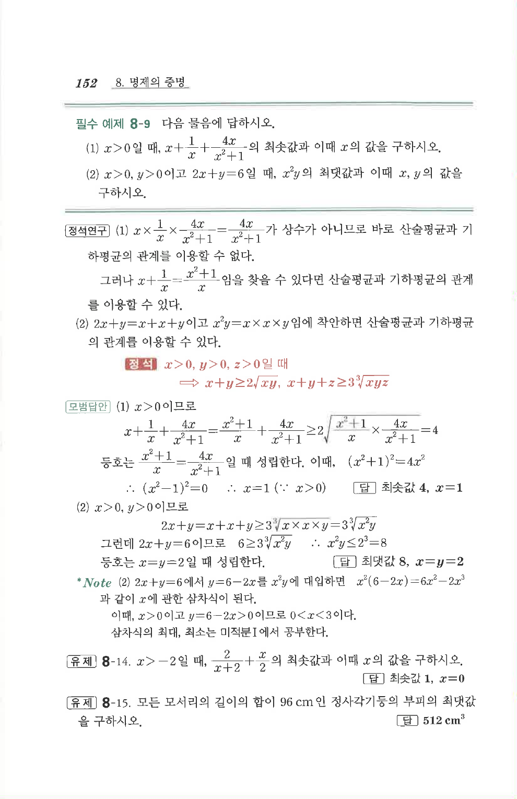

# 필수 예제 8-9

## 문제

다음 물음에 답하시오.

(1) $x>0$일 때,

$$x+\frac{1}{x}+\frac{4x}{x^2+1}$$

의 최솟값과 이때 $x$의 값을 구하시오.

(2) $x>0$, $y>0$이고 $2x+y=6$일 때, $x^2y$의 최댓값과 이때 $x,y$의 값을 구하시오.

## 정답

(1) 최솟값 $4$, $x=1$  
(2) 최댓값 $8$, $x=y=2$

## 원문 문제

## 원문

