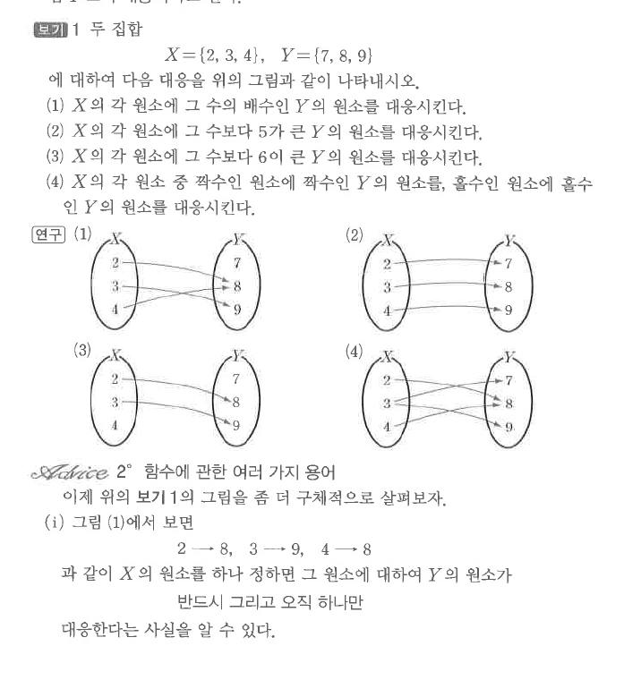
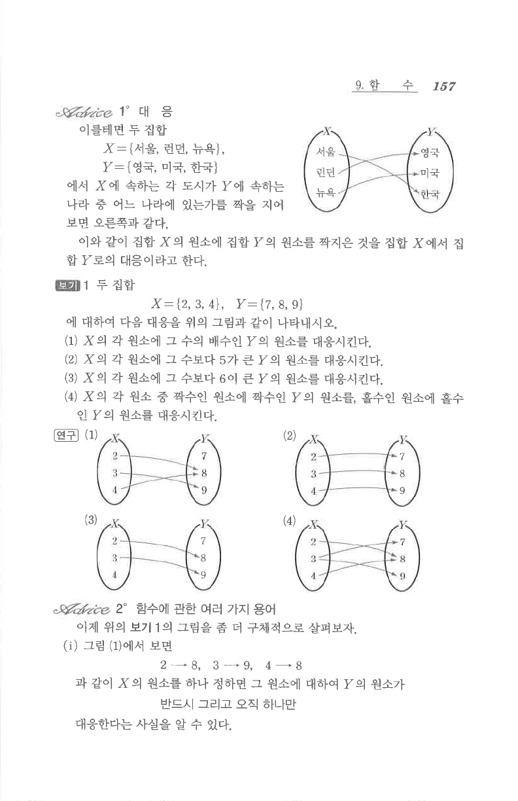

# S1 보기 1

## 문제

두 집합
$$X=\{2,3,4\},\qquad Y=\{7,8,9\}$$
에 대하여 다음 대응을 그림으로 나타내시오.

1. $X$의 각 원소에 그 수의 배수인 $Y$의 원소를 대응시킨다.
2. $X$의 각 원소에 그 수보다 $5$가 큰 $Y$의 원소를 대응시킨다.
3. $X$의 각 원소에 그 수보다 $6$이 큰 $Y$의 원소를 대응시킨다.
4. $X$의 각 원소 중 짝수인 원소에 짝수인 $Y$의 원소를, 홀수인 원소에 홀수인 $Y$의 원소를 대응시킨다.

## 정답

1. $2\mapsto8$, $3\mapsto9$, $4\mapsto8$
2. $2\mapsto7$, $3\mapsto8$, $4\mapsto9$
3. $2\mapsto8$, $3\mapsto9$이고, $4$에 대응하는 $Y$의 원소는 없다.
4. $2,4\mapsto8$, $3\mapsto7,9$

## 도형

두 집합 $X=\{2,3,4\}$와 $Y=\{7,8,9\}$ 사이의 대응도 네 개가 제시되어 있다.

## 원문

