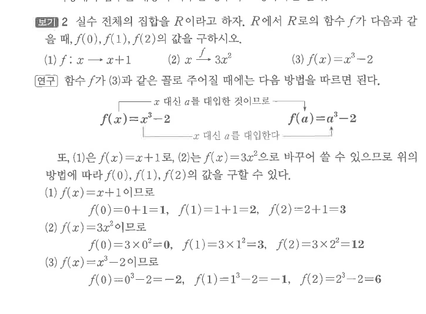
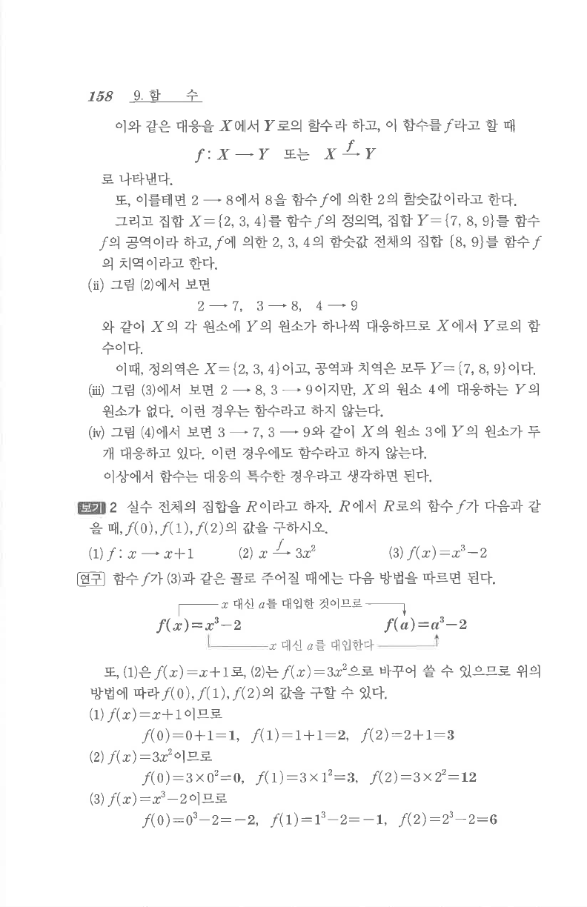

# S1 보기 2

## 문제

실수 전체의 집합을 $R$이라고 하자. $R$에서 $R$로의 함수 $f$가 다음과 같을 때, $f(0), f(1), f(2)$의 값을 구하시오.

1. $f:x\mapsto x+1$
2. $x\overset{f}{\longmapsto}3x^2$
3. $f(x)=x^3-2$

## 정답

1. $f(0)=1$, $f(1)=2$, $f(2)=3$
2. $f(0)=0$, $f(1)=3$, $f(2)=12$
3. $f(0)=-2$, $f(1)=-1$, $f(2)=6$

## 원문

