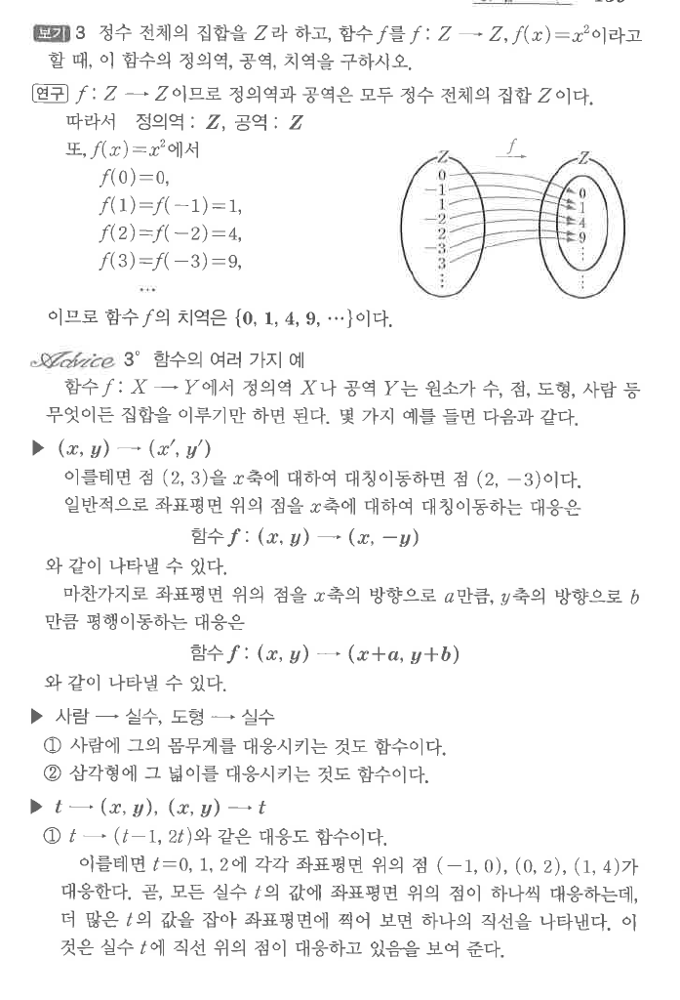
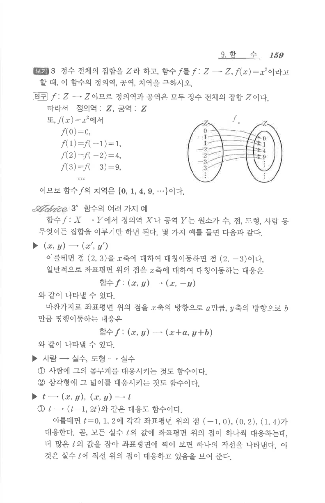

# S1 보기 3

## 문제

정수 전체의 집합을 $Z$라 하고, 함수 $f$를
$$f:Z\to Z,\qquad f(x)=x^2$$
이라고 할 때, 이 함수의 정의역, 공역, 치역을 구하시오.

## 정답

정의역: $Z$, 공역: $Z$, 치역: $\{0,1,4,9,\cdots\}$

## 도형

정수 $\cdots,-3,-2,-1,0,1,2,3,\cdots$가 제곱값 $0,1,4,9,\cdots$로 대응되는 그림이다.

## 원문

