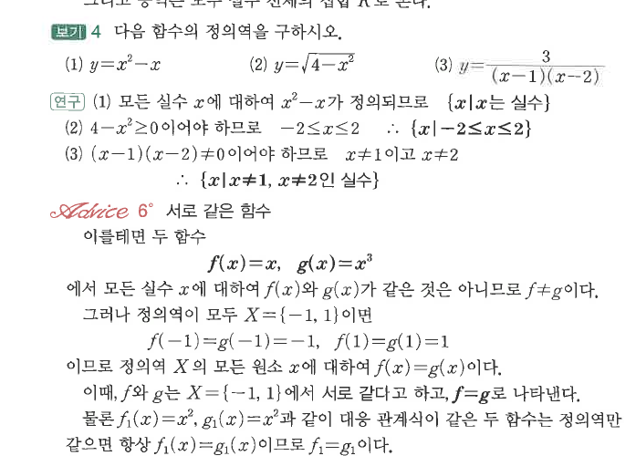
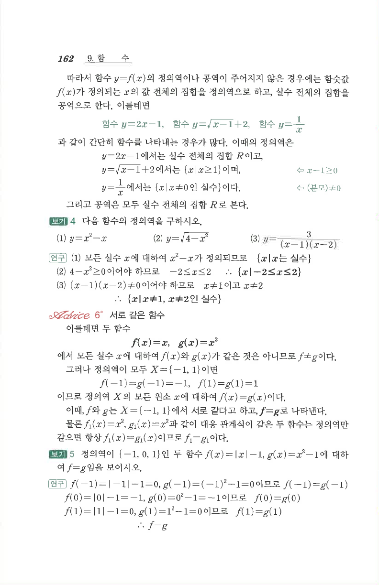

# S1 보기 4

## 문제

다음 함수의 정의역을 구하시오.

1. $y=x^2-x$
2. $y=\sqrt{4-x^2}$
3. $y=\dfrac{3}{(x-1)(x-2)}$

## 정답

1. $\{x\mid x\text{는 실수}\}$
2. $\{x\mid -2\le x\le2\}$
3. $\{x\mid x\ne1,\,x\ne2\text{인 실수}\}$

## 원문

