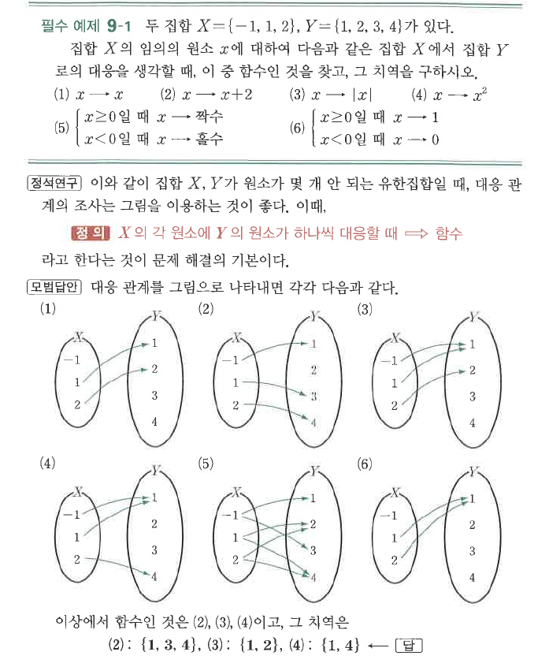
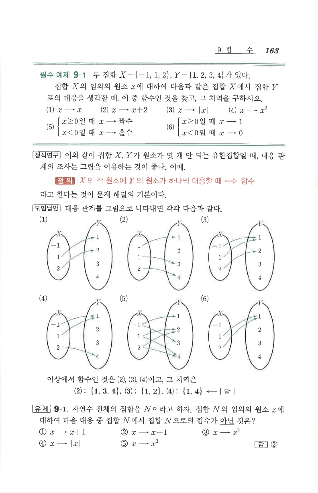

# 필수 예제 9-1

## 문제

두 집합 $X=\{-1,1,2\}$, $Y=\{1,2,3,4\}$가 있다. 집합 $X$의 임의의 원소 $x$에 대하여 다음과 같은 집합 $X$에서 집합 $Y$로의 대응을 생각할 때, 이 중 함수인 것을 찾고, 그 치역을 구하시오.

1. $x\mapsto x$
2. $x\mapsto x+2$
3. $x\mapsto |x|$
4. $x\mapsto x^2$
5. $\begin{cases}x\mapsto \text{짝수} & (x\ge0)\\x\mapsto \text{홀수} & (x<0)\end{cases}$
6. $\begin{cases}x\mapsto 1 & (x\ge0)\\x\mapsto 0 & (x<0)\end{cases}$

## 정답

함수인 것은 2, 3, 4이다.

2. 치역: $\{1,3,4\}$
3. 치역: $\{1,2\}$
4. 치역: $\{1,4\}$

## 도형

각 대응을 대응도로 나타내어 $X$의 모든 원소가 $Y$의 원소 하나에만 대응하는지 판별한다.

## 원문

