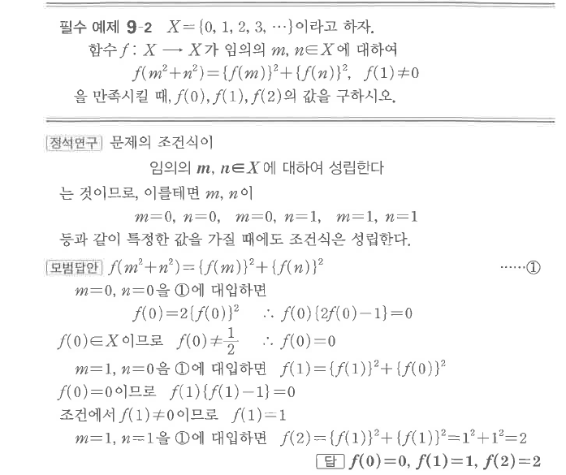
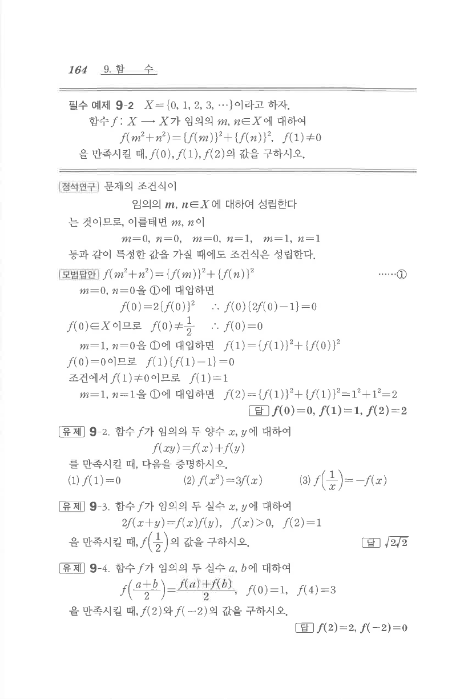

# 필수 예제 9-2

## 문제

$X=\{0,1,2,3,\cdots\}$라고 하자. 함수 $f:X\to X$가 임의의 $m,n\in X$에 대하여
$$f(m^2+n^2)=\{f(m)\}^2+\{f(n)\}^2,\qquad f(1)\ne0$$
을 만족시킬 때, $f(0), f(1), f(2)$의 값을 구하시오.

## 정답

$$f(0)=0,\\ f(1)=1,\\ f(2)=2$$

## 원문

