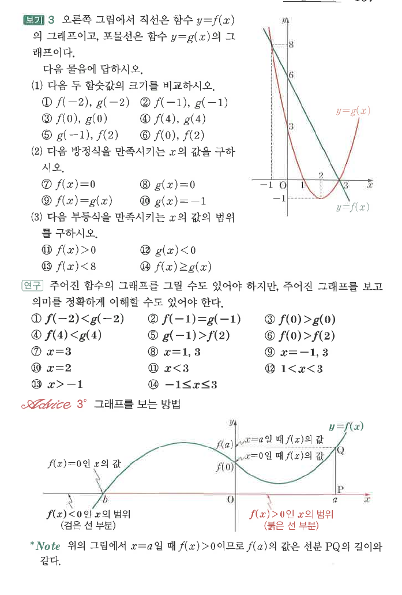
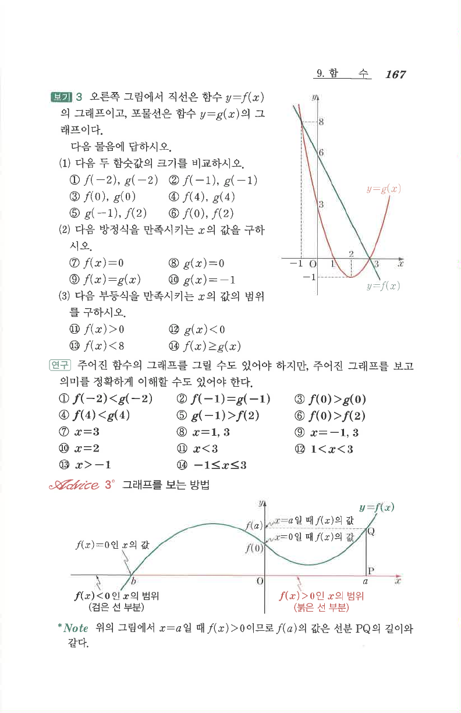

# S2 보기 3

## 문제

오른쪽 그림에서 직선은 함수 $y=f(x)$의 그래프이고, 포물선은 함수 $y=g(x)$의 그래프이다. 다음 물음에 답하시오.

1. 다음 두 함수값의 크기를 비교하시오.
   1. $f(-2),\ g(-2)$
   2. $f(-1),\ g(-1)$
   3. $f(0),\ g(0)$
   4. $f(4),\ g(4)$
   5. $g(-1),\ f(2)$
   6. $f(0),\ f(2)$
2. 다음 방정식을 만족시키는 $x$의 값을 구하시오.
   1. $f(x)=0$
   2. $g(x)=0$
   3. $f(x)=g(x)$
   4. $g(x)=-1$
3. 다음 부등식을 만족시키는 $x$의 값의 범위를 구하시오.
   1. $f(x)>0$
   2. $g(x)<0$
   3. $f(x)<8$
   4. $f(x)\ge g(x)$

## 정답

1. $f(-2)<g(-2)$, $f(-1)=g(-1)$, $f(0)>g(0)$, $f(4)<g(4)$, $g(-1)>f(2)$, $f(0)>f(2)$
2. $x=3$; $x=1,3$; $x=-1,3$; $x=2$
3. $x<3$; $1<x<3$; $x>-1$; $-1\le x\le3$

## 도형

직선 $y=f(x)$와 위로 열린 포물선 $y=g(x)$가 같은 좌표평면에 그려져 있다. 두 그래프는 $x=-1$, $x=3$에서 만난다.

## 원문

