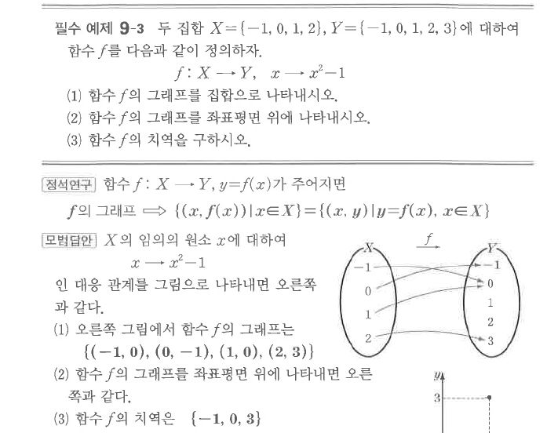

# 필수 예제 9-3

## 문제

두 집합
$$X=\{-1,0,1,2\},\qquad Y=\{-1,0,1,2,3\}$$
에 대하여 함수 $f$를 다음과 같이 정의하자.
$$f:X\to Y,\qquad x\mapsto x^2-1$$

1. 함수 $f$의 그래프를 집합으로 나타내시오.
2. 함수 $f$의 그래프를 좌표평면 위에 나타내시오.
3. 함수 $f$의 치역을 구하시오.

## 정답

1. $\{(-1,0),(0,-1),(1,0),(2,3)\}$
2. 좌표평면 위의 네 점 $(-1,0),(0,-1),(1,0),(2,3)$이다.
3. $\{-1,0,3\}$

## 도형

대응도와 좌표평면 위의 네 점으로 함수의 그래프가 나타나 있다.

## 원문

