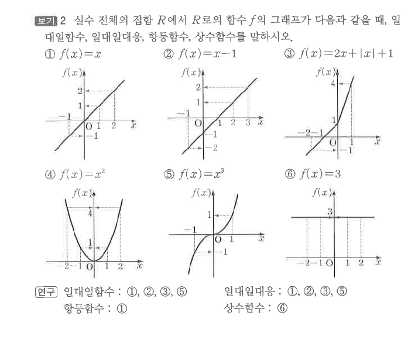

# S3 보기 2

## 문제

실수 전체의 집합 $R$에서 $R$로의 함수 $f$의 그래프가 다음과 같을 때, 일대일함수, 일대일대응, 항등함수, 상수함수를 말하시오.

1. $f(x)=x$
2. $f(x)=x-1$
3. $f(x)=2x+|x|+1$
4. $f(x)=x^2$
5. $f(x)=x^3$
6. $f(x)=3$

## 정답

일대일함수: ①, ②, ③, ⑤

일대일대응: ①, ②, ③, ⑤

항등함수: ①

상수함수: ⑥

## 도형

여섯 함수의 그래프가 좌표평면에 그려져 있으며, 수평선 판정과 치역을 이용해 분류한다.

## 원문

