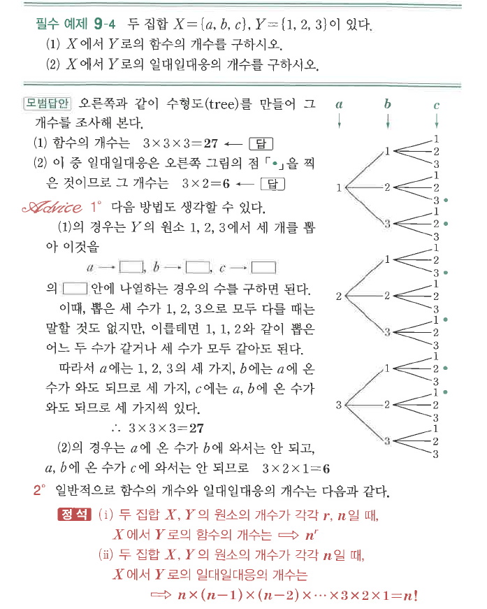
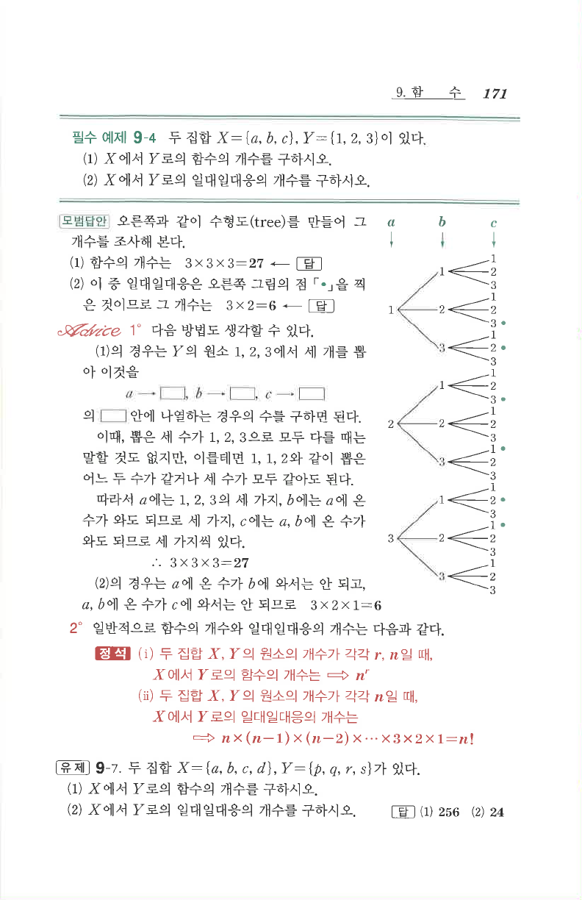

# 필수 예제 9-4

## 문제

두 집합
$$X=\{a,b,c\},\qquad Y=\{1,2,3\}$$
이 있다.

1. $X$에서 $Y$로의 함수의 개수를 구하시오.
2. $X$에서 $Y$로의 일대일대응의 개수를 구하시오.

## 정답

1. $3^3=27$
2. $3\times2\times1=6$

## 도형

수형도(tree)를 이용하여 함수와 일대일대응의 개수를 세는 그림이 있다.

## 원문

