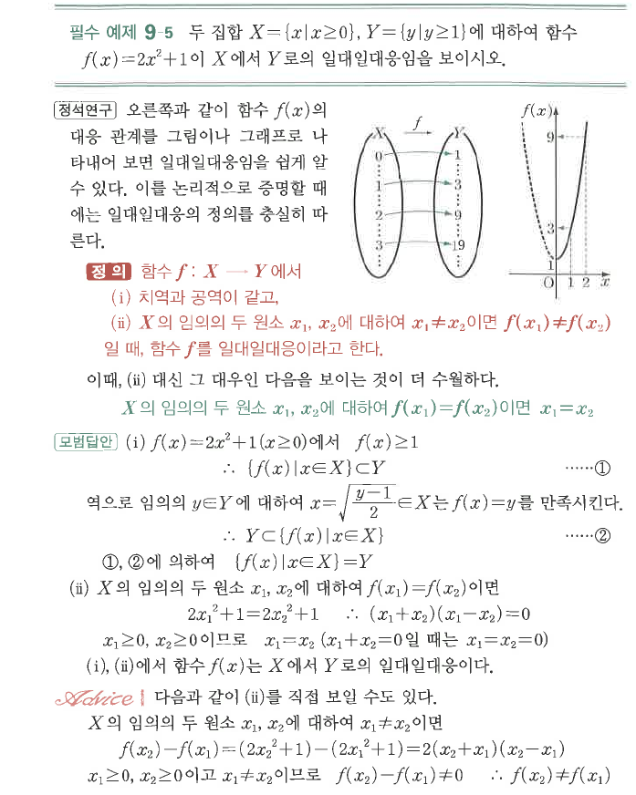
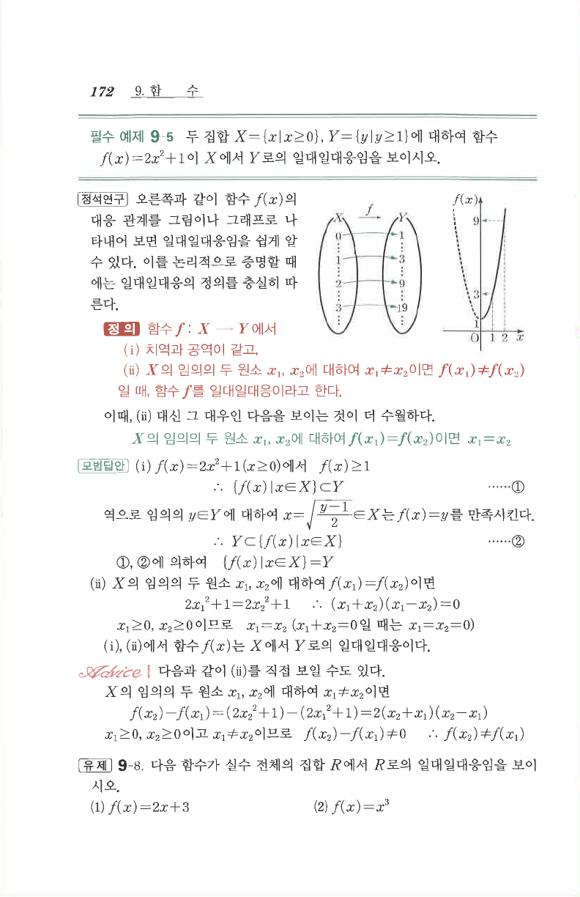

# 필수 예제 9-5

## 문제

두 집합
$$X=\{x\mid x\ge0\},\qquad Y=\{y\mid y\ge1\}$$
에 대하여 함수
$$f(x)=2x^2+1$$
이 $X$에서 $Y$로의 일대일대응임을 보이시오.

## 정답

$x\ge0$에서 $f(x)=2x^2+1\ge1$이고, 임의의 $y\ge1$에 대하여 $x=\sqrt{\dfrac{y-1}{2}}\in X$가 존재하여 $f(x)=y$이다. 또한 $x_1,x_2\in X$에서 $f(x_1)=f(x_2)$이면 $x_1=x_2$이므로 일대일대응이다.

## 도형

대응도와 $y=2x^2+1$의 그래프가 함께 제시되어 있다.

## 원문

