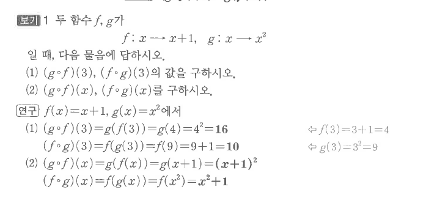
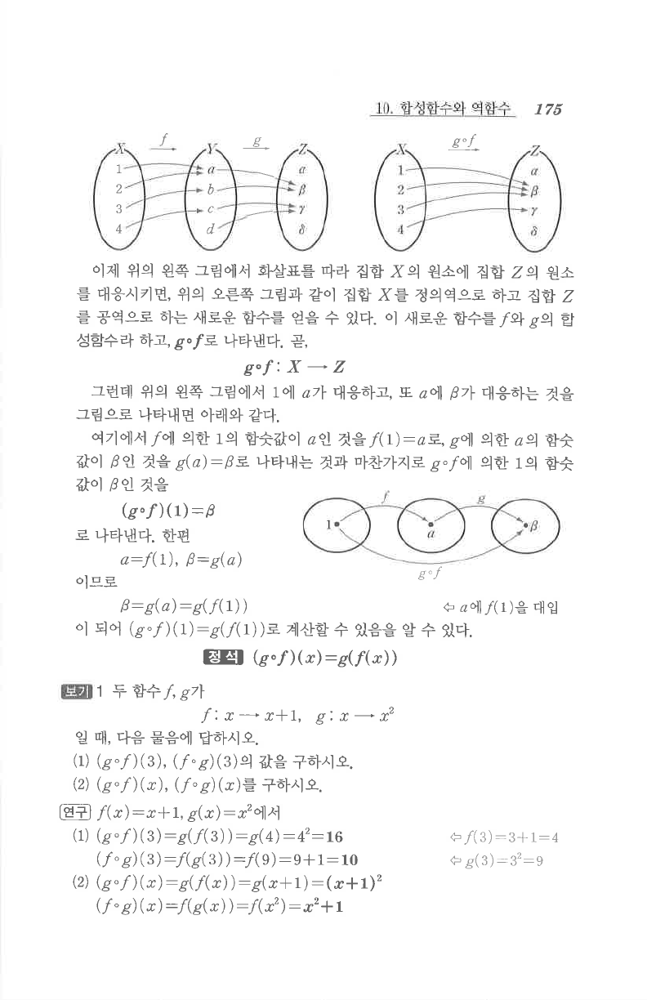

# S1 보기 1

## 문제

두 함수 $f$, $g$가
$$f:x\mapsto x+1,\qquad g:x\mapsto x^2$$
일 때, 다음 물음에 답하시오.

1. $(g\circ f)(3)$, $(f\circ g)(3)$의 값을 구하시오.
2. $(g\circ f)(x)$, $(f\circ g)(x)$를 구하시오.

## 정답

1. $(g\circ f)(3)=16$, $(f\circ g)(3)=10$
2. $(g\circ f)(x)=(x+1)^2$, $(f\circ g)(x)=x^2+1$

## 원문

