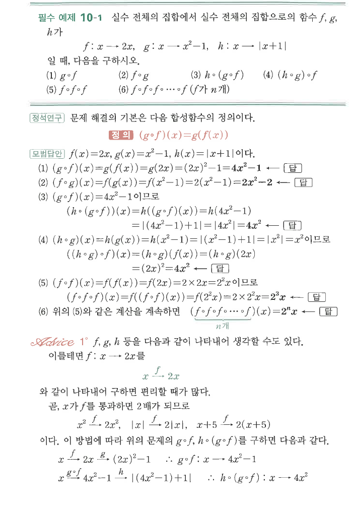
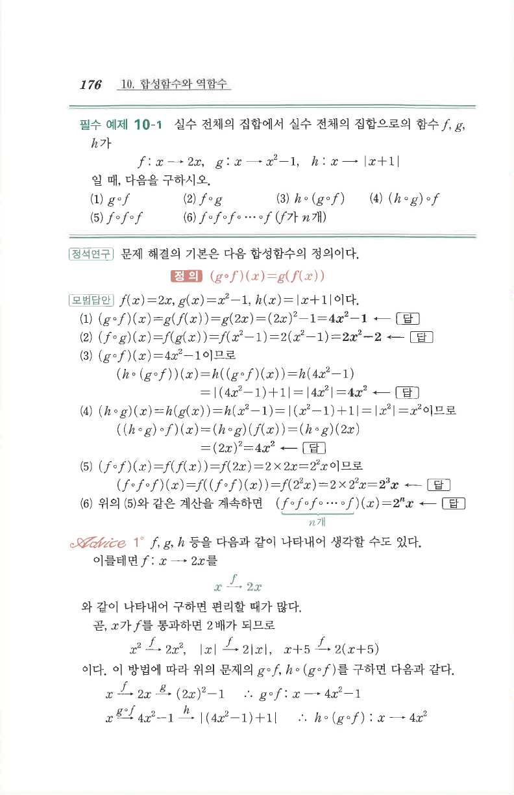

# 필수 예제 10-1

## 문제

실수 전체의 집합에서 실수 전체의 집합으로의 함수 $f$, $g$, $h$가
$$f:x\mapsto 2x,\qquad g:x\mapsto x^2-1,\qquad h:x\mapsto |x+1|$$
일 때, 다음을 구하시오.

1. $g\circ f$
2. $f\circ g$
3. $h\circ(g\circ f)$
4. $(h\circ g)\circ f$
5. $f\circ f\circ f$
6. $\underbrace{f\circ f\circ\cdots\circ f}_{n\text{개}}$

## 정답

1. $(g\circ f)(x)=4x^2-1$
2. $(f\circ g)(x)=2x^2-2$
3. $(h\circ(g\circ f))(x)=4x^2$
4. $((h\circ g)\circ f)(x)=4x^2$
5. $(f\circ f\circ f)(x)=2^3x$
6. $\left(\underbrace{f\circ f\circ\cdots\circ f}_{n\text{개}}\right)(x)=2^n x$

## 원문

