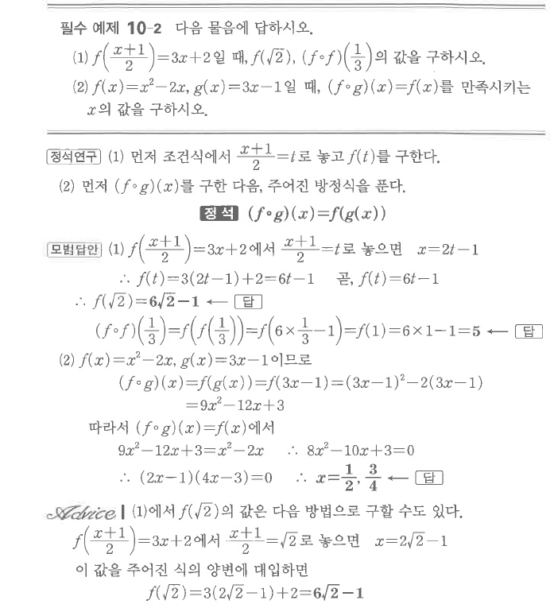
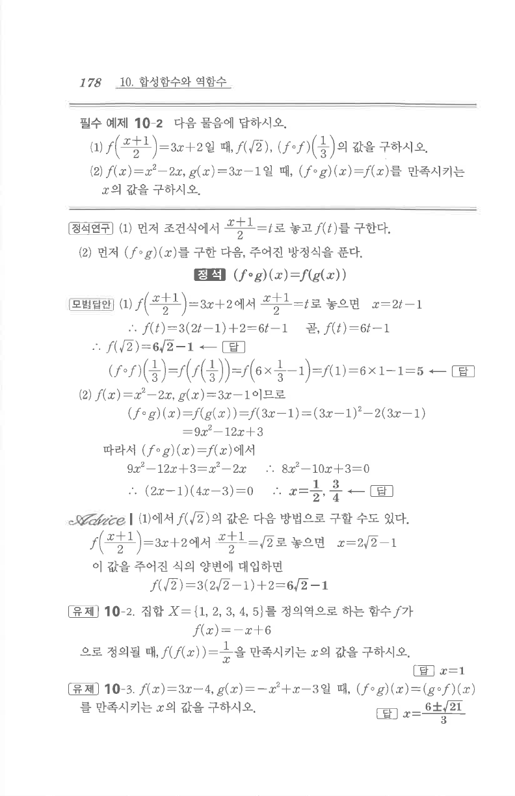

# 필수 예제 10-2

## 문제

다음 물음에 답하시오.

1. $f\left(\dfrac{x+1}{2}\right)=3x+2$일 때, $f(\sqrt2)$, $(f\circ f)\left(\dfrac13\right)$의 값을 구하시오.
2. $f(x)=x^2-2x$, $g(x)=3x-1$일 때, $(f\circ g)(x)=f(x)$를 만족시키는 $x$의 값을 구하시오.

## 정답

1. $f(\sqrt2)=6\sqrt2-1$, $(f\circ f)\left(\dfrac13\right)=5$
2. $x=\dfrac12,\ \dfrac34$

## 원문

