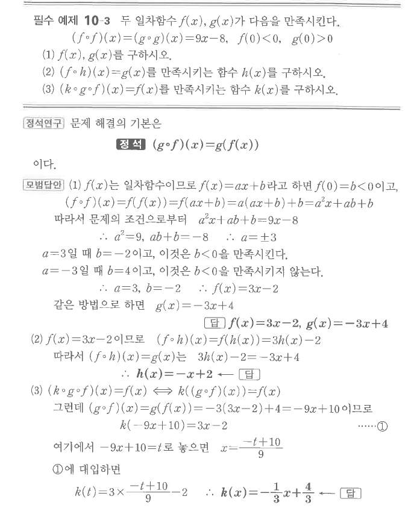

# 필수 예제 10-3

## 문제

두 일차함수 $f(x)$, $g(x)$가 다음을 만족시킨다.
$$(f\circ f)(x)=(g\circ g)(x)=9x-8,\qquad f(0)<0,\qquad g(0)>0$$

1. $f(x)$, $g(x)$를 구하시오.
2. $(f\circ h)(x)=g(x)$를 만족시키는 함수 $h(x)$를 구하시오.
3. $(k\circ g\circ f)(x)=f(x)$를 만족시키는 함수 $k(x)$를 구하시오.

## 정답

1. $f(x)=3x-2$, $g(x)=-3x+4$
2. $h(x)=-x+2$
3. $k(x)=-\dfrac13x+\dfrac43$

## 원문

