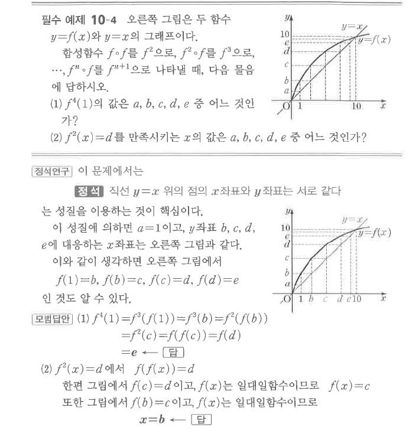

# 필수 예제 10-4

## 문제

오른쪽 그림은 두 함수 $y=f(x)$와 $y=x$의 그래프이다. 합성함수 $f\circ f$를 $f^2$으로, $f^2\circ f$를 $f^3$으로, $\cdots$, $f^n\circ f$를 $f^{n+1}$으로 나타낼 때, 다음 물음에 답하시오.

1. $f^4(1)$의 값은 $a$, $b$, $c$, $d$, $e$ 중 어느 것인가?
2. $f^2(x)=d$를 만족시키는 $x$의 값은 $a$, $b$, $c$, $d$, $e$ 중 어느 것인가?

## 정답

1. $e$
2. $b$

## 도형

증가하는 그래프 $y=f(x)$와 직선 $y=x$가 함께 제시되어 있다. 표시된 점들은 $f(1)=b$, $f(b)=c$, $f(c)=d$, $f(d)=e$가 되도록 점선으로 연결되어 있다.

## 원문

