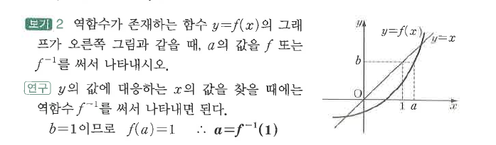
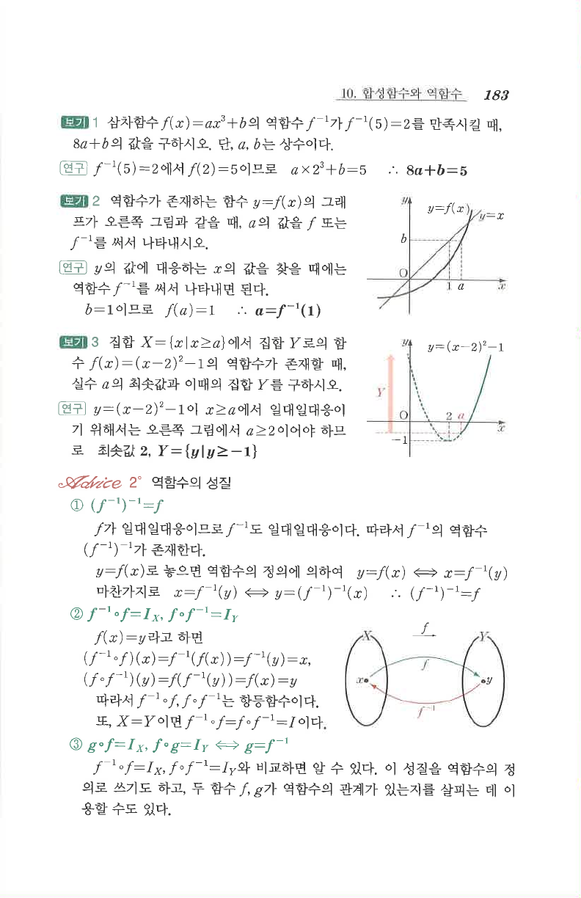

# S2 보기 2

## 문제

역함수가 존재하는 함수 $y=f(x)$의 그래프가 오른쪽 그림과 같을 때, $a$의 값을 $f$ 또는 $f^{-1}$을 써서 나타내시오.

## 정답

$a=f^{-1}(1)$

## 도형

좌표평면에 $y=f(x)$와 직선 $y=x$가 그려져 있고, $x=a$에서 함수값이 $1$이 되도록 점선이 표시되어 있다. 즉 $f(a)=1$이다.

## 원문

