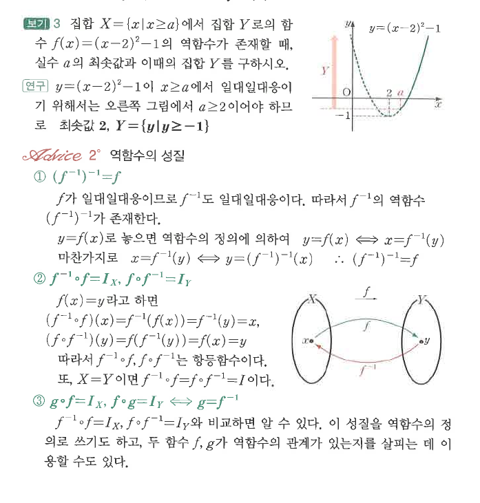

# S2 보기 3

## 문제

집합 $X=\{x\mid x\ge a\}$에서 집합 $Y$로의 함수
$$f(x)=(x-2)^2-1$$
의 역함수가 존재할 때, 실수 $a$의 최솟값과 이때의 집합 $Y$를 구하시오.

## 정답

$a$의 최솟값은 $2$, 이때 $Y=\{y\mid y\ge -1\}$이다.

## 도형

포물선 $y=(x-2)^2-1$의 꼭짓점은 $(2,-1)$이다. 정의역을 $x\ge a$로 제한하여 일대일대응이 되게 하려면 오른쪽 가지에서 시작해야 하므로 $a\ge2$가 필요하다.

## 원문

