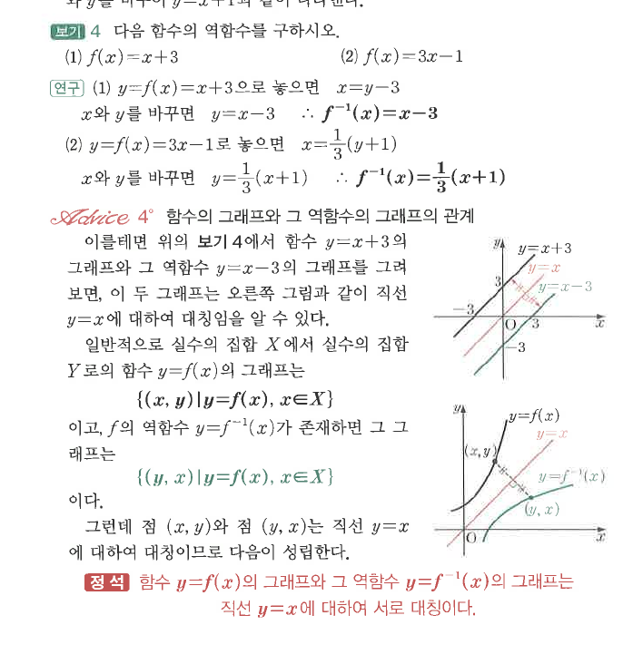
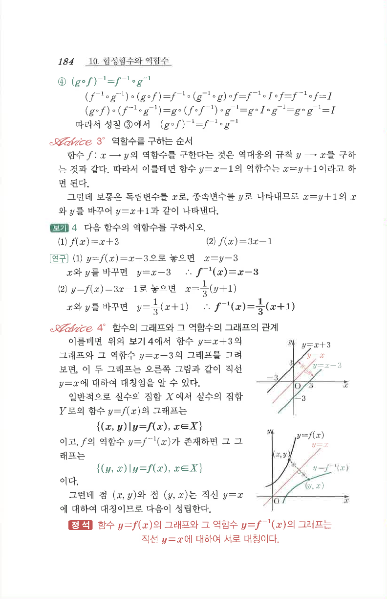

# S2 보기 4

## 문제

다음 함수의 역함수를 구하시오.

1. $f(x)=x+3$
2. $f(x)=3x-1$

## 정답

1. $f^{-1}(x)=x-3$
2. $f^{-1}(x)=\dfrac13(x+1)$

## 도형

함수 $y=x+3$과 그 역함수 $y=x-3$의 그래프가 직선 $y=x$에 대하여 대칭임을 보여 주는 그래프가 함께 제시되어 있다.

## 원문

