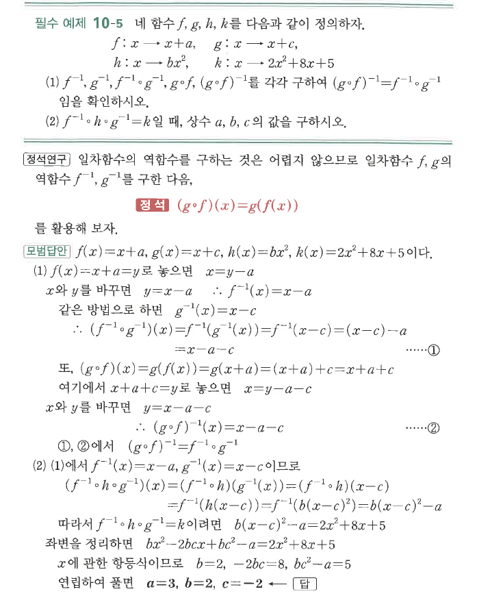

# 필수 예제 10-5

## 문제

네 함수 $f$, $g$, $h$, $k$를 다음과 같이 정의하자.
$$f:x\mapsto x+a,\qquad g:x\mapsto x+c,$$
$$h:x\mapsto bx^2,\qquad k:x\mapsto 2x^2+8x+5$$

1. $f^{-1}$, $g^{-1}$, $f^{-1}\circ g^{-1}$, $g\circ f$, $(g\circ f)^{-1}$를 각각 구하여 $(g\circ f)^{-1}=f^{-1}\circ g^{-1}$임을 확인하시오.
2. $f^{-1}\circ h\circ g^{-1}=k$일 때, 상수 $a$, $b$, $c$의 값을 구하시오.

## 정답

1. $f^{-1}(x)=x-a$, $g^{-1}(x)=x-c$, $(f^{-1}\circ g^{-1})(x)=x-a-c$, $(g\circ f)(x)=x+a+c$, $(g\circ f)^{-1}(x)=x-a-c$
2. $a=3$, $b=2$, $c=-2$

## 원문

