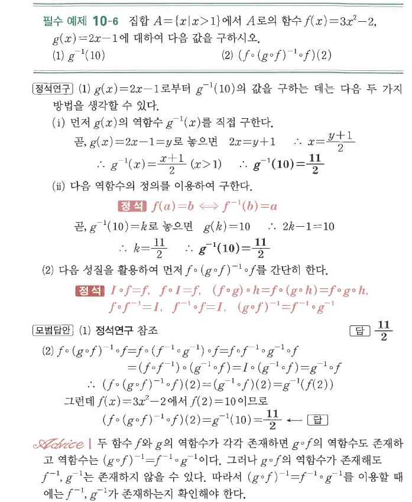
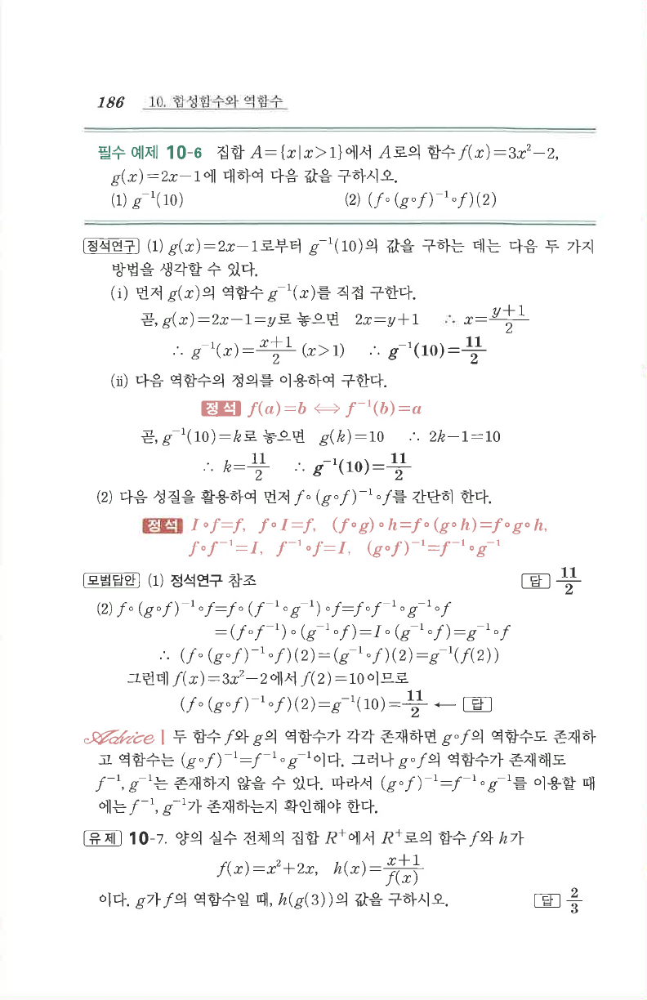

# 필수 예제 10-6

## 문제

집합 $A=\{x\mid x>1\}$에서 $A$로의 함수
$$f(x)=3x^2-2,\qquad g(x)=2x-1$$
에 대하여 다음 값을 구하시오.

1. $g^{-1}(10)$
2. $\bigl(f\circ(g\circ f)^{-1}\circ f\bigr)(2)$

## 정답

1. $\dfrac{11}{2}$
2. $\dfrac{11}{2}$

## 원문

