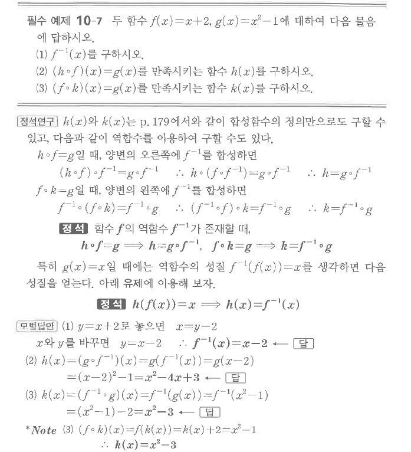

# 필수 예제 10-7

## 문제

두 함수 $f(x)=x+2$, $g(x)=x^2-1$에 대하여 다음 물음에 답하시오.

1. $f^{-1}(x)$를 구하시오.
2. $(h\circ f)(x)=g(x)$를 만족시키는 함수 $h(x)$를 구하시오.
3. $(f\circ k)(x)=g(x)$를 만족시키는 함수 $k(x)$를 구하시오.

## 정답

1. $f^{-1}(x)=x-2$
2. $h(x)=x^2-4x+3$
3. $k(x)=x^2-3$

## 원문

