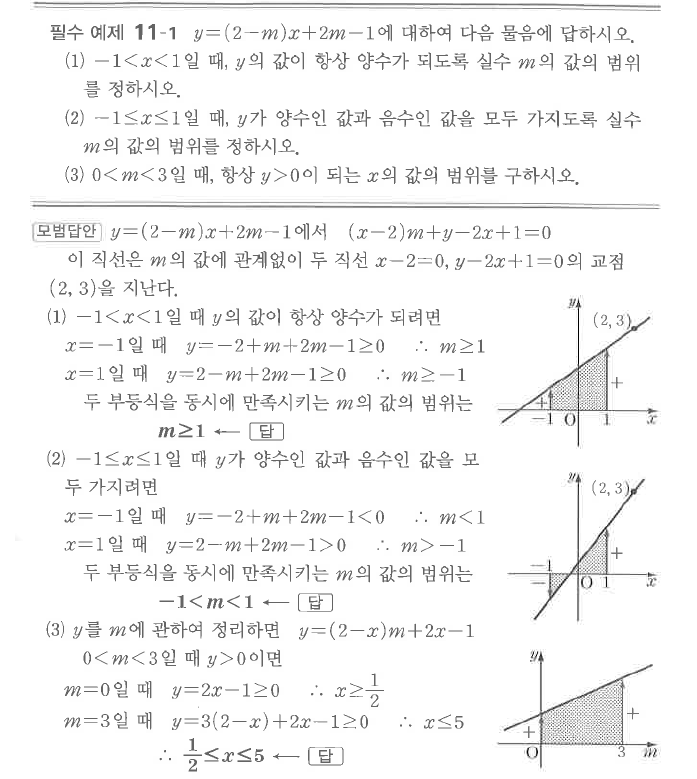

# 필수 예제 11-1

## 문제

$y=(2-m)x+2m-1$에 대하여 다음 물음에 답하시오.

1. $-1<x<1$일 때, $y$의 값이 항상 양수가 되도록 실수 $m$의 값의 범위를 정하시오.
2. $-1\le x\le1$일 때, $y$가 양수인 값과 음수인 값을 모두 가지도록 실수 $m$의 값의 범위를 정하시오.
3. $0<m<3$일 때, 항상 $y>0$이 되는 $x$의 값의 범위를 구하시오.

## 정답

1. $m\ge1$
2. $-1<m<1$
3. $\dfrac12\le x\le5$

## 도형

직선 $y=(2-m)x+2m-1$을 $m$에 관한 식으로 보면 모든 직선이 점 $(2,3)$을 지난다. 원문에는 $x$ 또는 $m$의 구간 끝값을 이용해 부호가 유지되는 영역이 음영으로 표시되어 있다.

## 원문

