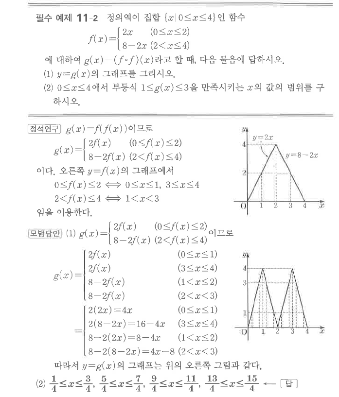
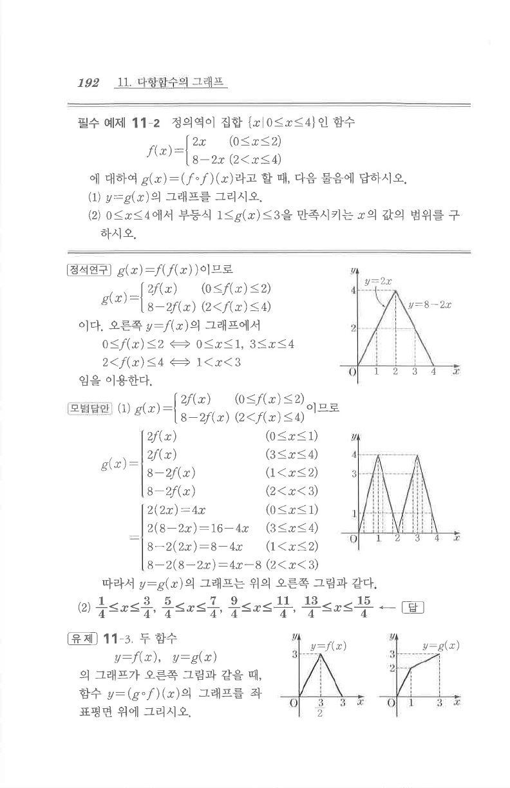

# 필수 예제 11-2

## 문제

정의역이 집합 $\{x\mid 0\le x\le4\}$인 함수
$$
f(x)=\begin{cases}
2x & (0\le x\le2)\\
8-2x & (2<x\le4)
\end{cases}
$$
에 대하여 $g(x)=(f\circ f)(x)$라고 할 때, 다음 물음에 답하시오.

1. $y=g(x)$의 그래프를 그리시오.
2. $0\le x\le4$에서 부등식 $1\le g(x)\le3$을 만족시키는 $x$의 값의 범위를 구하시오.

## 정답

2. $\dfrac14\le x\le\dfrac34$, $\dfrac54\le x\le\dfrac74$, $\dfrac94\le x\le\dfrac{11}4$, $\dfrac{13}4\le x\le\dfrac{15}4$

## 도형

$f$는 $(0,0)$에서 $(2,4)$까지 증가한 뒤 $(4,0)$까지 감소하는 삼각형 모양의 그래프이다. $g=f\circ f$는 $[0,4]$에서 네 구간으로 나뉘는 톱니형 선분 그래프가 된다.

## 원문

