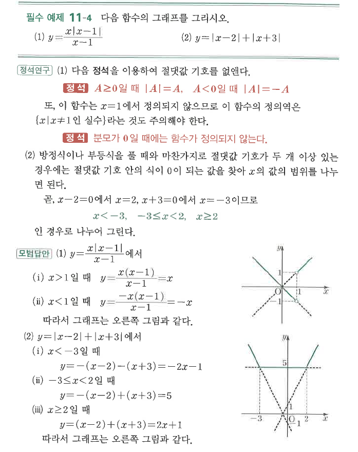
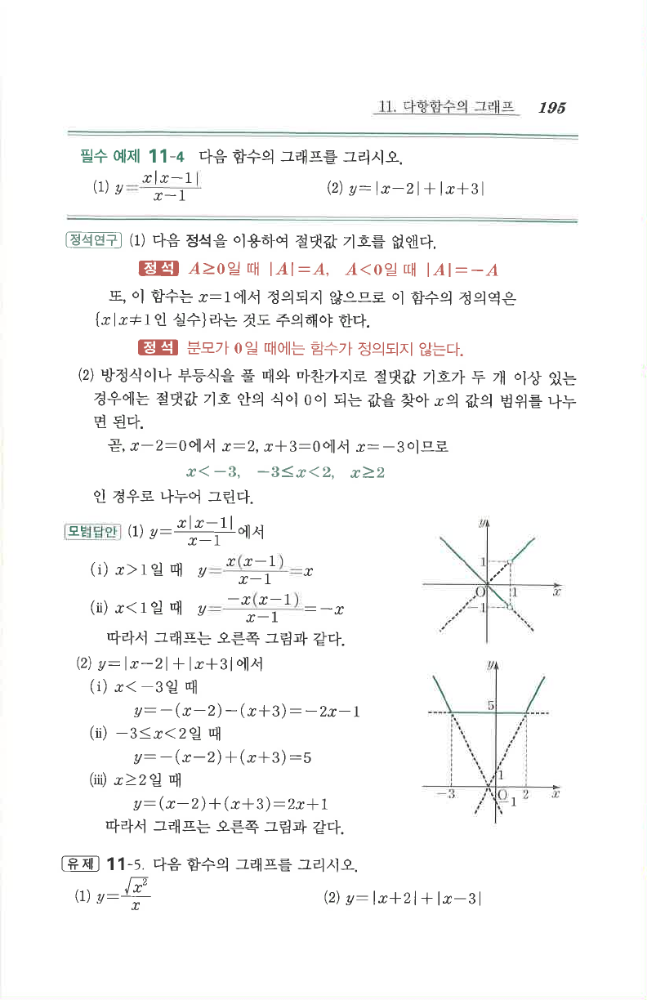

# 필수 예제 11-4

## 문제

다음 함수의 그래프를 그리시오.

1. $y=\dfrac{x|x-1|}{x-1}$
2. $y=|x-2|+|x+3|$

## 도형

(1)은 $x=1$에서 정의되지 않으며, $x>1$에서는 $y=x$, $x<1$에서는 $y=-x$이다. (2)는 $x=-3$, $x=2$를 기준으로 나뉘며 가운데 구간 $-3\le x<2$에서는 $y=5$인 수평선이 된다.

## 원문

