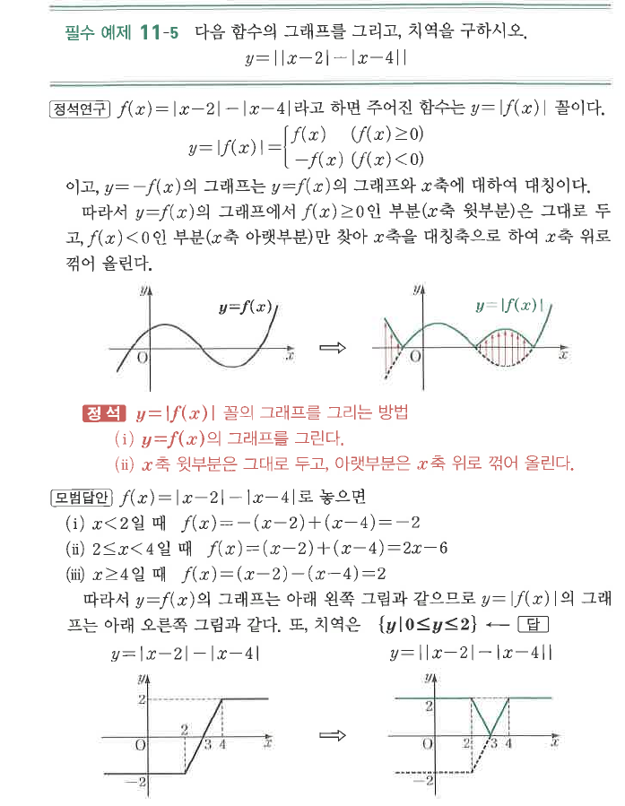
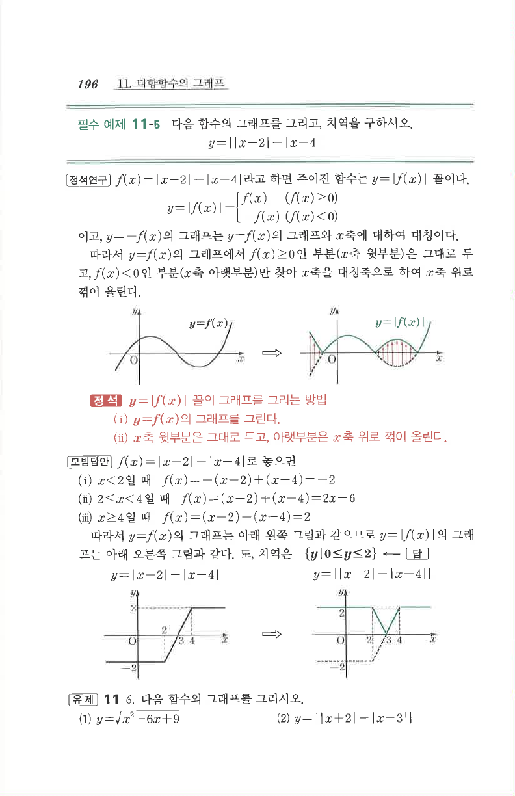

# 필수 예제 11-5

## 문제

다음 함수의 그래프를 그리고, 치역을 구하시오.
$$y=\bigl||x-2|-|x-4|\bigr|$$

## 정답

치역은 $\{y\mid 0\le y\le2\}$이다.

## 도형

먼저 $y=|x-2|-|x-4|$를 그린 뒤, $x$축 아래쪽 부분을 위로 접어 올린 그래프이다. 결과 그래프는 $0$과 $2$ 사이의 값만 가진다.

## 원문

