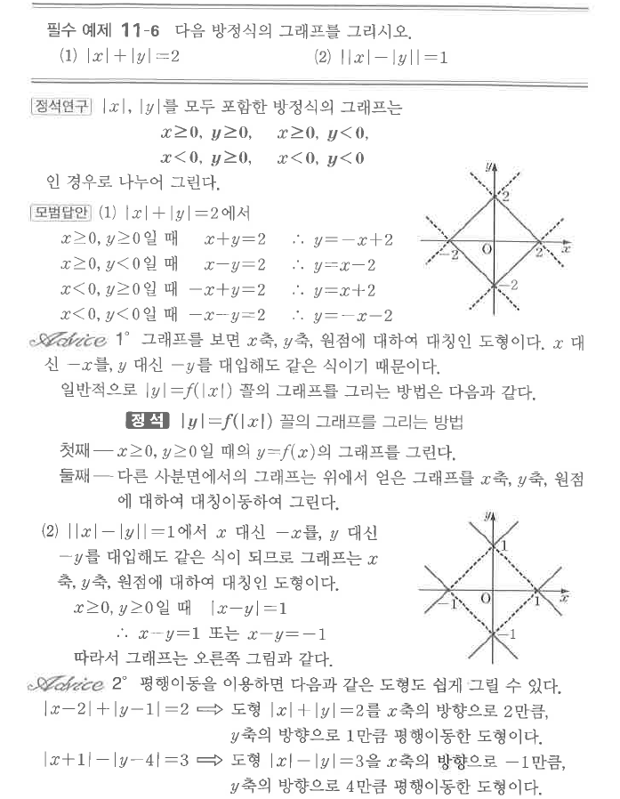

# 필수 예제 11-6

## 문제

다음 방정식의 그래프를 그리시오.

1. $|x|+|y|=2$
2. $\bigl||x|-|y|\bigr|=1$

## 도형

(1)은 꼭짓점이 $(\pm2,0)$, $(0,\pm2)$인 마름모이다. (2)는 $x$축, $y$축, 원점에 대하여 모두 대칭인 네 개의 V자형 선분으로 이루어진 그래프이다.

## 원문

