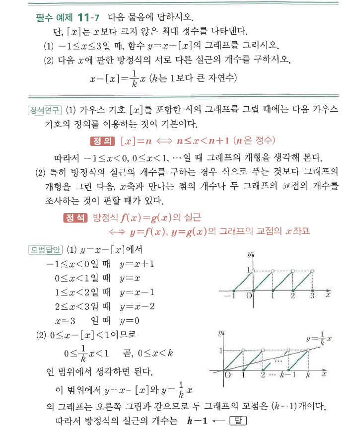

# 필수 예제 11-7

## 문제

다음 물음에 답하시오. 단, $[x]$는 $x$보다 크지 않은 최대 정수를 나타낸다.

1. $-1\le x\le3$일 때, 함수 $y=x-[x]$의 그래프를 그리시오.
2. 다음 $x$에 관한 방정식의 서로 다른 실근의 개수를 구하시오.
   $$x-[x]=\frac1k x\qquad(k\text{는 }1\text{보다 큰 자연수})$$

## 정답

2. $k-1$

## 도형

$y=x-[x]$는 각 구간 $[n,n+1)$에서 $0$부터 $1$ 직전까지 증가하는 반복 선분 그래프이다. 두 번째 문제는 이 그래프와 직선 $y=\frac1k x$의 교점 개수를 세는 구조이다.

## 원문

