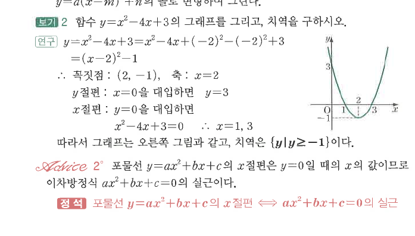
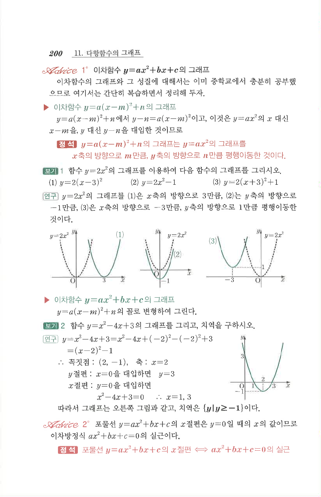

# S3 보기 2

## 문제

함수 $y=x^2-4x+3$의 그래프를 그리고, 치역을 구하시오.

## 정답

꼭짓점은 $(2,-1)$, 축은 $x=2$, $x$절편은 $1$, $3$이고, 치역은 $\{y\mid y\ge-1\}$이다.

## 도형

아래로가 아니라 위로 볼록한 포물선이며, 꼭짓점 $(2,-1)$을 지나고 $x$축과 $x=1,3$에서 만난다.

## 원문

