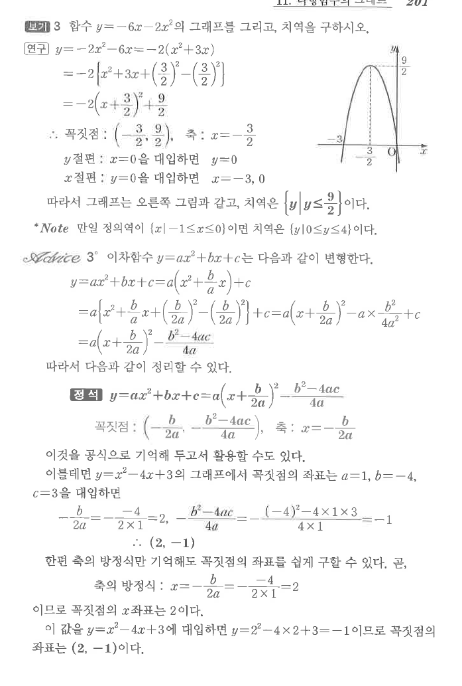
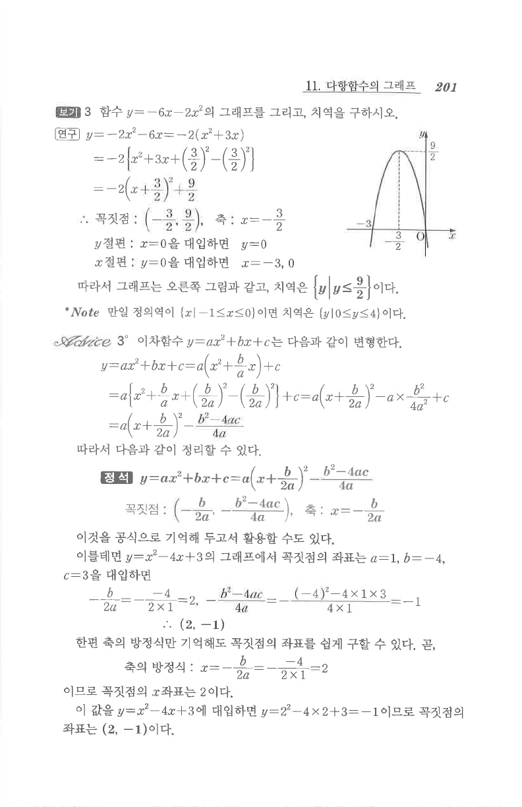

# S3 보기 3

## 문제

함수 $y=-6x-2x^2$의 그래프를 그리고, 치역을 구하시오.

## 정답

꼭짓점은 $\left(-\dfrac32,\dfrac92\right)$, 축은 $x=-\dfrac32$, $x$절편은 $-3$, $0$이고, 치역은 $\left\{y\mid y\le\dfrac92\right\}$이다.

## 도형

아래로 볼록한 포물선이다. $x$축과 $x=-3,0$에서 만나며 꼭짓점은 $x=-\frac32$ 위에 있다.

## 원문

