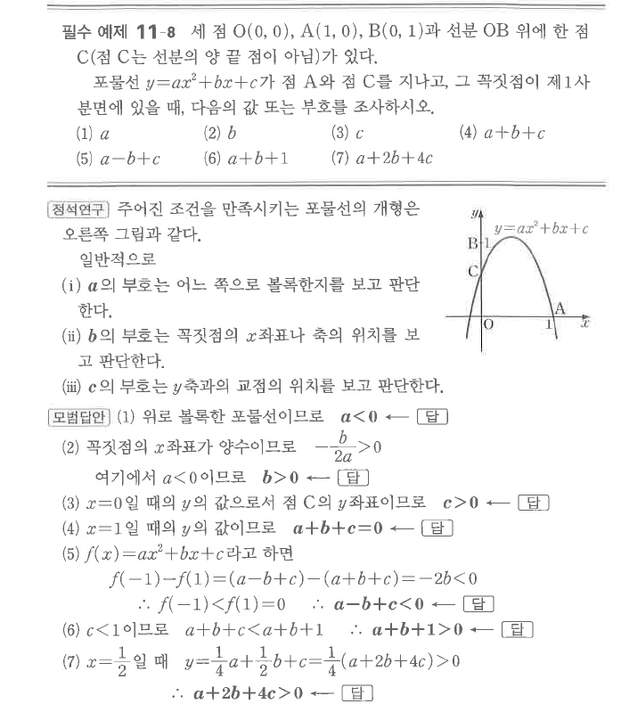
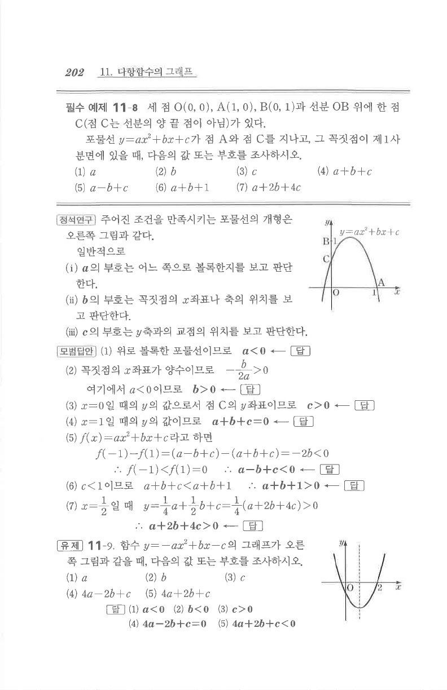

# 필수 예제 11-8

## 문제

세 점 $O(0,0)$, $A(1,0)$, $B(0,1)$과 선분 $OB$ 위에 한 점 $C$가 있다. 단, 점 $C$는 선분의 양 끝점이 아니다. 포물선
$$y=ax^2+bx+c$$
가 점 $A$와 점 $C$를 지나고, 그 꼭짓점이 제1사분면에 있을 때, 다음의 값 또는 부호를 조사하시오.

1. $a$
2. $b$
3. $c$
4. $a+b+c$
5. $a-b+c$
6. $a+b+1$
7. $a+2b+4c$

## 정답

1. $a<0$
2. $b>0$
3. $c>0$
4. $a+b+c=0$
5. $a-b+c<0$
6. $a+b+1>0$
7. $a+2b+4c>0$

## 도형

포물선은 점 $A(1,0)$와 $y$축 위의 점 $C$를 지나며 위로 볼록하지 않고 아래로 볼록한 형태이다. 꼭짓점은 제1사분면에 있다.

## 원문

