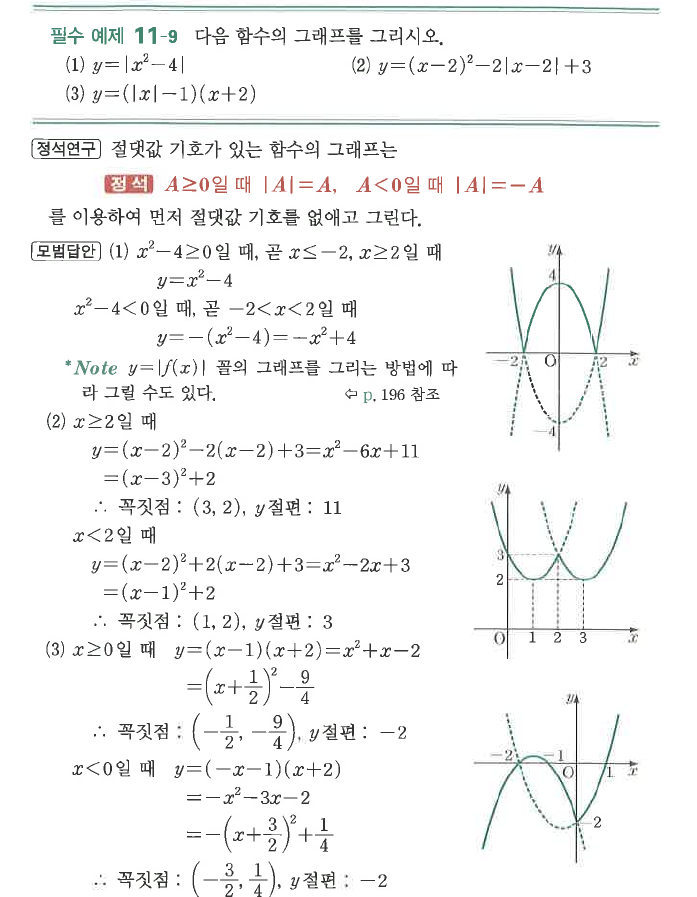

# 필수 예제 11-9

## 문제

다음 함수의 그래프를 그리시오.

1. $y=|x^2-4|$
2. $y=(x-2)^2-2|x-2|+3$
3. $y=(|x|-1)(x+2)$

## 도형

(1)은 $y=x^2-4$의 $x$축 아래 부분을 위로 접어 올린 그래프이다. (2)는 $x=2$를 기준으로 절댓값을 풀어 두 개의 위로 볼록한 포물선 조각이 이어진다. (3)은 $x=0$을 기준으로 서로 다른 이차식 조각으로 나뉜다.

## 원문

