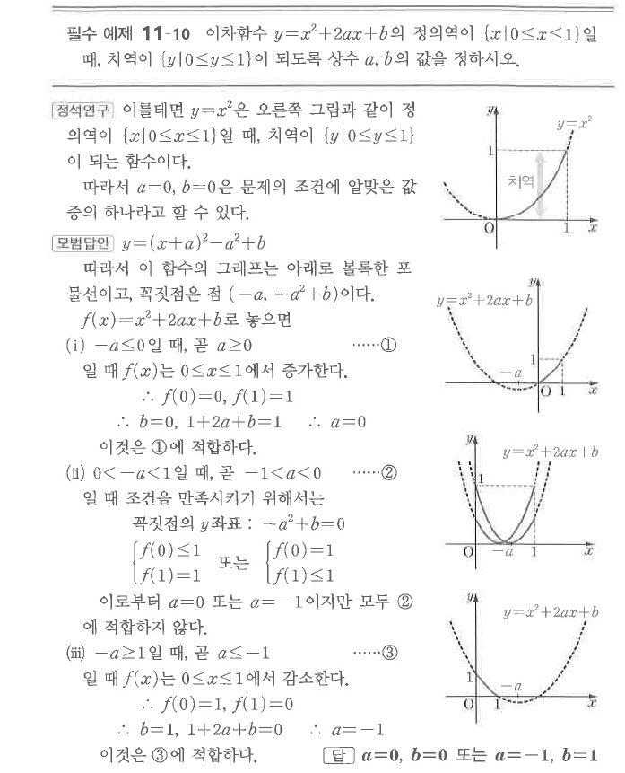
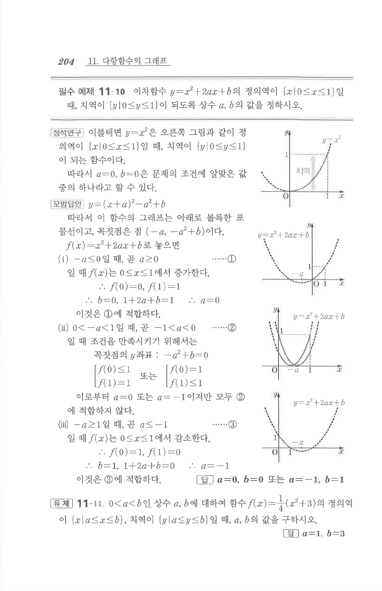

# 필수 예제 11-10

## 문제

이차함수 $y=x^2+2ax+b$의 정의역이 $\{x\mid0\le x\le1\}$일 때, 치역이 $\{y\mid0\le y\le1\}$이 되도록 상수 $a$, $b$의 값을 정하시오.

## 정답

$a=0$, $b=0$ 또는 $a=-1$, $b=1$

## 도형

정의역 $0\le x\le1$에서 포물선의 꼭짓점 위치에 따라 증가하는 경우, 내부에 꼭짓점이 있는 경우, 감소하는 경우를 나누어 판단한다.

## 원문

