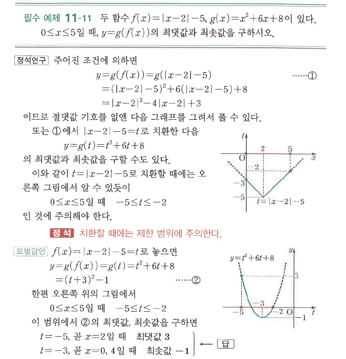

# 필수 예제 11-11

## 문제

두 함수 $f(x)=|x-2|-5$, $g(x)=x^2+6x+8$이 있다. $0\le x\le5$일 때, $y=g(f(x))$의 최댓값과 최솟값을 구하시오.

## 정답

최댓값은 $3$, 최솟값은 $-1$이다.

## 도형

$t=|x-2|-5$로 치환하면 $0\le x\le5$에서 $-5\le t\le-2$이다. $y=g(t)=(t+3)^2-1$의 제한 구간에서 최댓값과 최솟값을 읽는다.

## 원문

