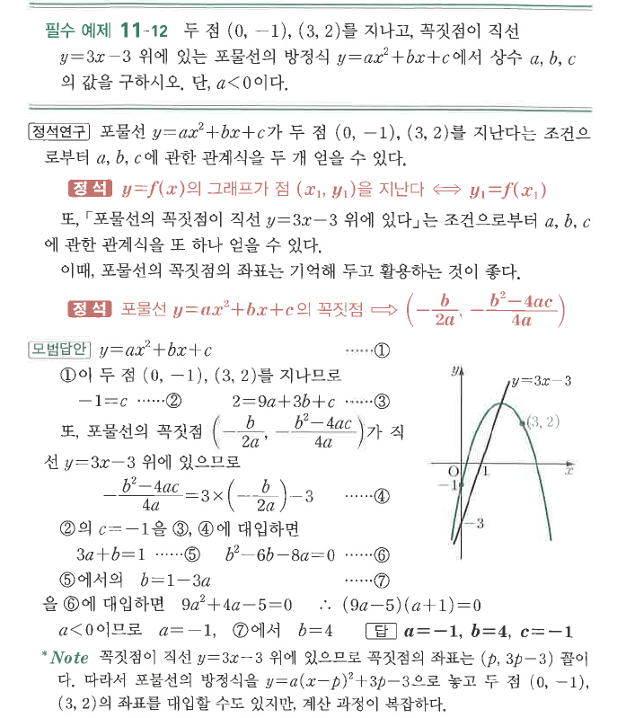

# 필수 예제 11-12

## 문제

두 점 $(0,-1)$, $(3,2)$를 지나고, 꼭짓점이 직선 $y=3x-3$ 위에 있는 포물선의 방정식 $y=ax^2+bx+c$에서 상수 $a$, $b$, $c$의 값을 구하시오. 단, $a<0$이다.

## 정답

$a=-1$, $b=4$, $c=-1$

## 도형

포물선은 $(0,-1)$과 $(3,2)$를 지나며, 꼭짓점이 직선 $y=3x-3$ 위에 놓인다. 원문 그림에는 아래로 볼록한 포물선과 직선이 함께 표시되어 있다.

## 원문

