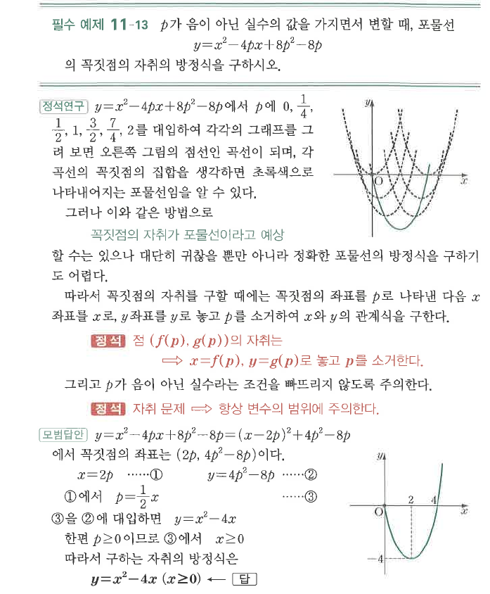

# 필수 예제 11-13

## 문제

$p$가 음이 아닌 실수의 값을 가지면서 변할 때, 포물선
$$y=x^2-4px+8p^2-8p$$
의 꼭짓점의 자취의 방정식을 구하시오.

## 정답

$y=x^2-4x\quad(x\ge0)$

## 도형

$p$가 변할 때 여러 포물선의 꼭짓점들이 하나의 포물선 위를 움직인다. $p\ge0$이므로 자취의 범위는 $x\ge0$으로 제한된다.

## 원문

