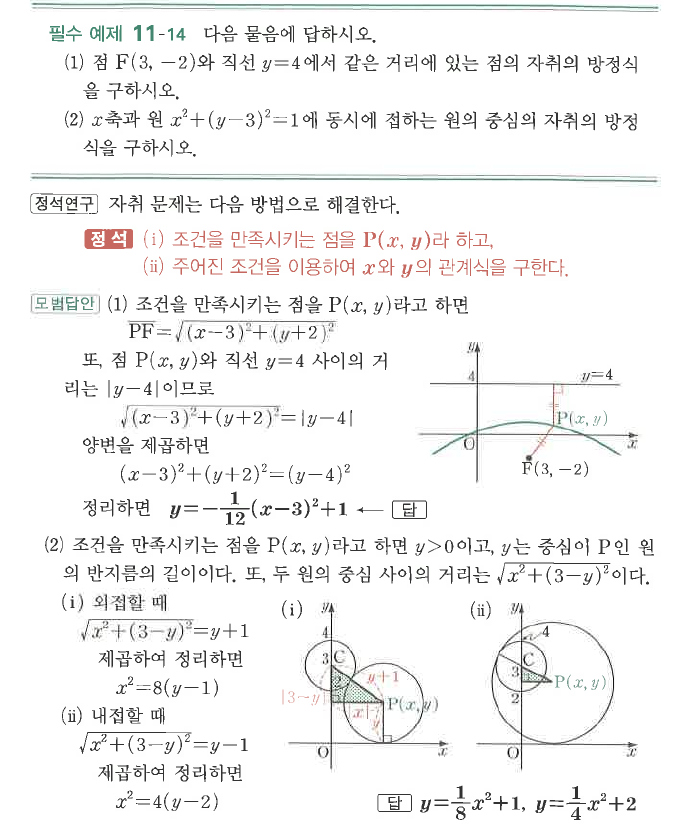

# 필수 예제 11-14

## 문제

다음 물음에 답하시오.

1. 점 $F(3,-2)$와 직선 $y=4$에서 같은 거리에 있는 점의 자취의 방정식을 구하시오.
2. $x$축과 원 $x^2+(y-3)^2=1$에 동시에 접하는 원의 중심의 자취의 방정식을 구하시오.

## 정답

1. $y=-\dfrac1{12}(x-3)^2+1$
2. $y=\dfrac18x^2+1$, $y=\dfrac14x^2+2$

## 도형

(1)은 초점 $F(3,-2)$와 준선 $y=4$로 정해지는 포물선이다. (2)는 $x$축과 주어진 원에 동시에 접하는 원의 중심 $P(x,y)$의 자취이며, 외접과 내접 두 경우가 나뉜다.

## 원문

