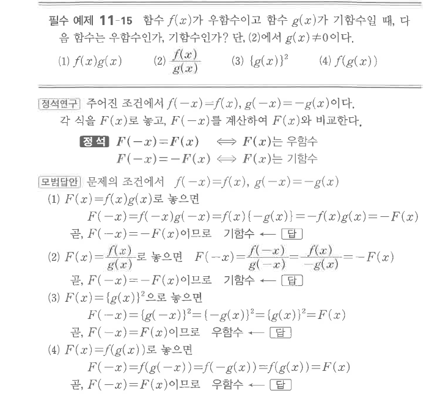
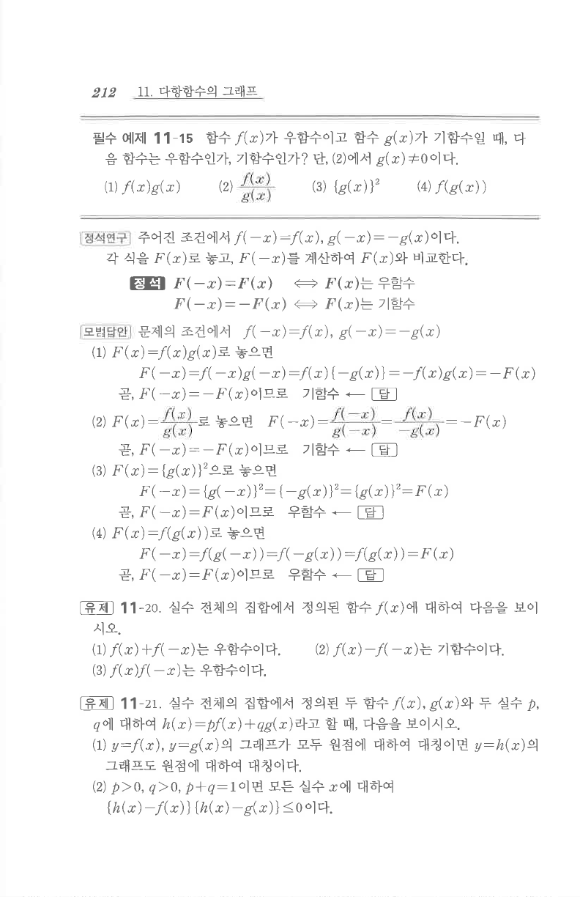

# 필수 예제 11-15

## 문제

함수 $f(x)$가 우함수이고 함수 $g(x)$가 기함수일 때, 다음 함수는 우함수인가, 기함수인가? 단, 2에서 $g(x)\ne0$이다.

1. $f(x)g(x)$
2. $\dfrac{f(x)}{g(x)}$
3. $\{g(x)\}^2$
4. $f(g(x))$

## 정답

1. 기함수
2. 기함수
3. 우함수
4. 우함수

## 원문

