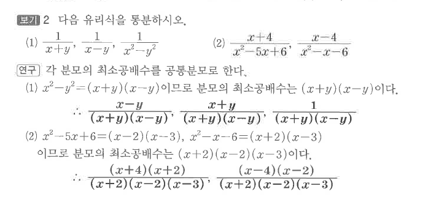

# S1 보기 2

## 문제

다음 유리식을 통분하시오.

1. $\dfrac1{x+y}$, $\dfrac1{x-y}$, $\dfrac1{x^2-y^2}$
2. $\dfrac{x+4}{x^2-5x+6}$, $\dfrac{x-4}{x^2-x-6}$

## 정답

1. 공통분모 $(x+y)(x-y)$
2. 공통분모 $(x+2)(x-2)(x-3)$

## 원문

