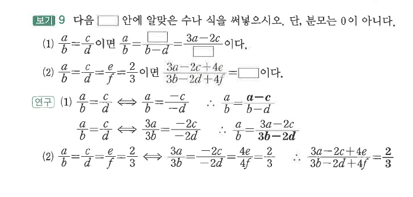
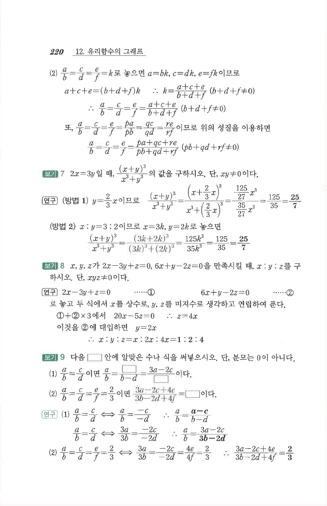

# S1 보기 9

## 문제

다음 빈칸 안에 알맞은 수나 식을 써넣으시오. 단, 분모는 $0$이 아니다.

1. $\dfrac{a}{b}=-\dfrac{c}{d}$이면
   $$\frac{a}{b}=\boxed{\phantom{\frac{a-c}{b-d}}}=\frac{3a-2c}{\boxed{\phantom{3b-2d}}}$$
   이다.
2. $\dfrac{a}{b}=-\dfrac{c}{d}=\dfrac{e}{f}=\dfrac23$이면
   $$\frac{3a-2c+4e}{3b-2d+4f}=\boxed{\phantom{\frac23}}$$
   이다.

## 정답

1. $\dfrac{a-c}{b-d}$, $3b-2d$
2. $\dfrac23$

## 원문

