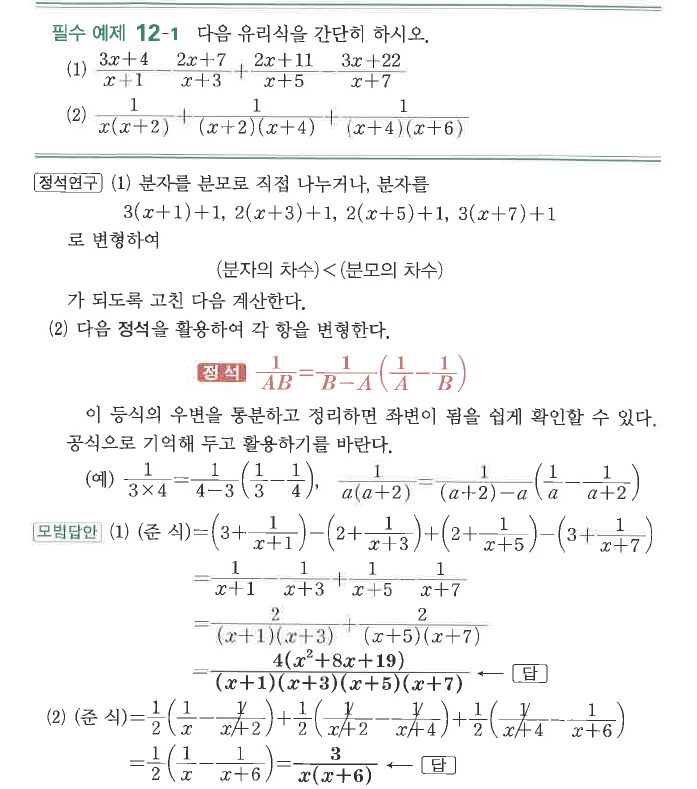

# 필수 예제 12-1

## 문제

다음 유리식을 간단히 하시오.

1. $$\frac{3x+4}{x+1}-\frac{2x+7}{x+3}+\frac{2x+11}{x+5}-\frac{3x+22}{x+7}$$
2. $$\frac1{x(x+2)}+\frac1{(x+2)(x+4)}+\frac1{(x+4)(x+6)}$$

## 정답

1. $\dfrac{4(x^2+8x+19)}{(x+1)(x+3)(x+5)(x+7)}$
2. $\dfrac3{x(x+6)}$

## 원문

