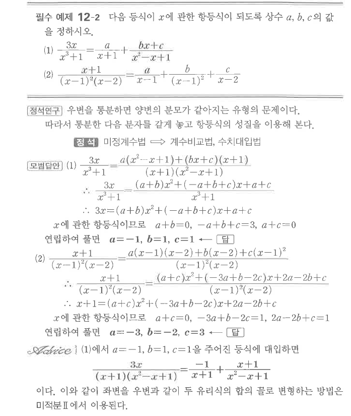

# 필수 예제 12-2

## 문제

다음 등식이 $x$에 관한 항등식이 되도록 상수 $a$, $b$, $c$의 값을 정하시오.

1. $$\frac{3x}{x^3+1}=\frac{a}{x+1}+\frac{bx+c}{x^2-x+1}$$
2. $$\frac{x+1}{(x-1)^2(x-2)}=\frac{a}{x-1}+\frac{b}{(x-1)^2}+\frac{c}{x-2}$$

## 정답

1. $a=-1$, $b=1$, $c=1$
2. $a=-3$, $b=-2$, $c=3$

## 원문

