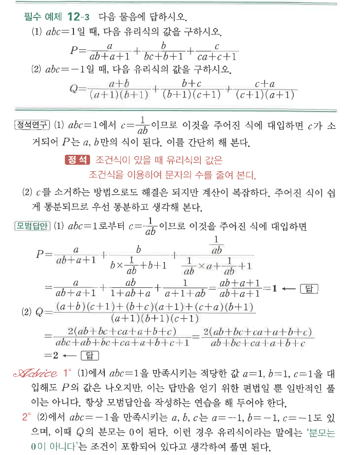

# 필수 예제 12-3

## 문제

다음 물음에 답하시오.

1. $abc=1$일 때,
$$P=\frac{a}{ab+a+1}+\frac{b}{bc+b+1}+\frac{c}{ca+c+1}$$
의 값을 구하시오.
2. $abc=-1$일 때,
$$Q=\frac{a+b}{(a+1)(b+1)}+\frac{b+c}{(b+1)(c+1)}+\frac{c+a}{(c+1)(a+1)}$$
의 값을 구하시오.

## 정답

1. $P=1$
2. $Q=2$

## 원문

