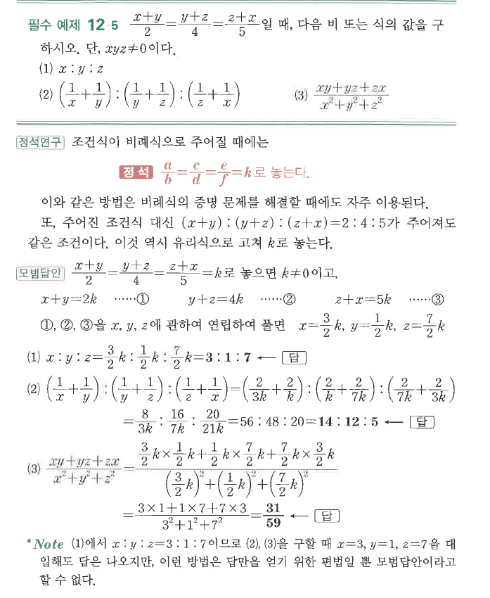
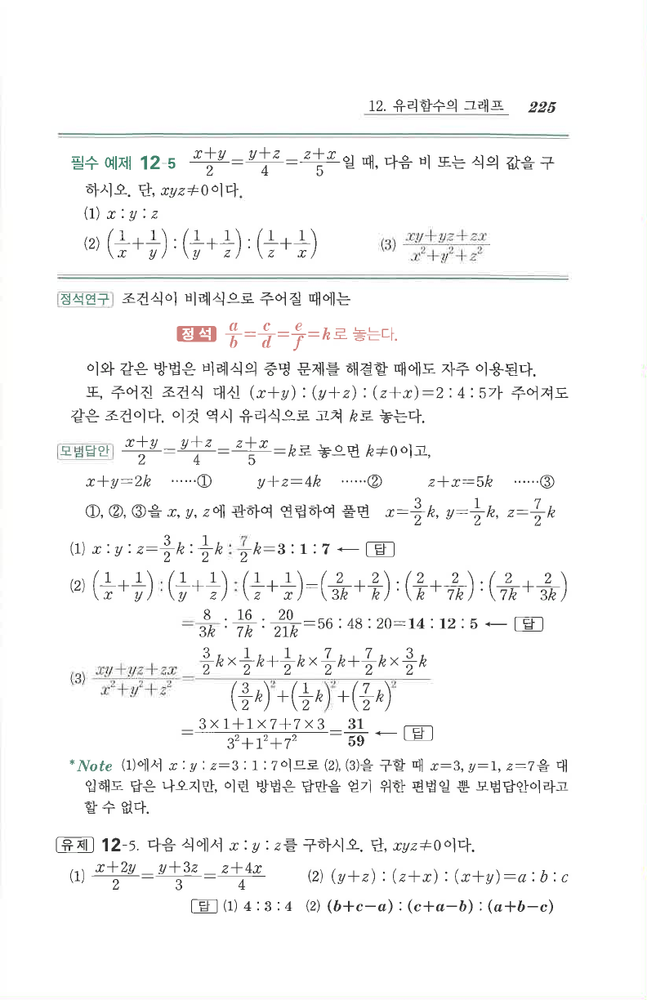

# 필수 예제 12-5

## 문제

$$\frac{x+y}{2}=\frac{y+z}{4}=\frac{z+x}{5}$$
일 때, 다음 비 또는 식의 값을 구하시오. 단, $xyz\ne0$이다.

1. $x:y:z$
2. $\left(\dfrac1x+\dfrac1y\right):\left(\dfrac1y+\dfrac1z\right):\left(\dfrac1z+\dfrac1x\right)$
3. $\dfrac{xy+yz+zx}{x^2+y^2+z^2}$

## 정답

1. $3:1:7$
2. $14:12:5$
3. $\dfrac{31}{59}$

## 원문

