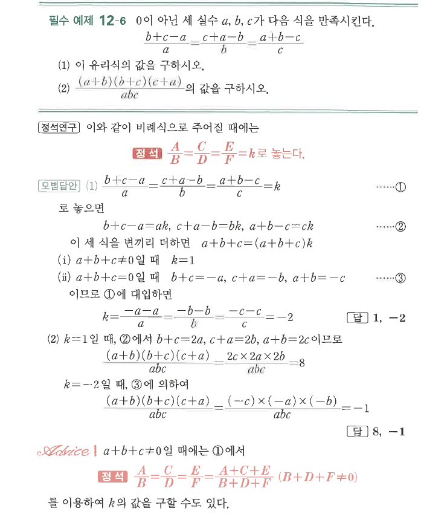
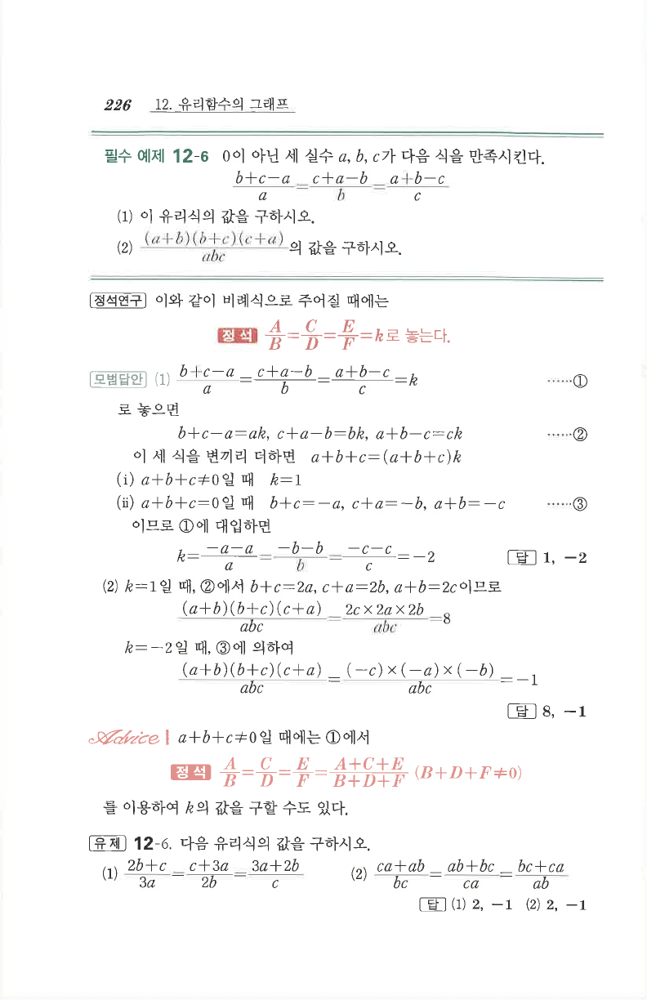

# 필수 예제 12-6

## 문제

$0$이 아닌 세 실수 $a$, $b$, $c$가 다음 식을 만족시킨다.
$$\frac{b+c-a}{a}=\frac{c+a-b}{b}=\frac{a+b-c}{c}$$

1. 이 유리식의 값을 구하시오.
2. $\dfrac{(a+b)(b+c)(c+a)}{abc}$의 값을 구하시오.

## 정답

1. $1$, $-2$
2. $8$, $-1$

## 원문

