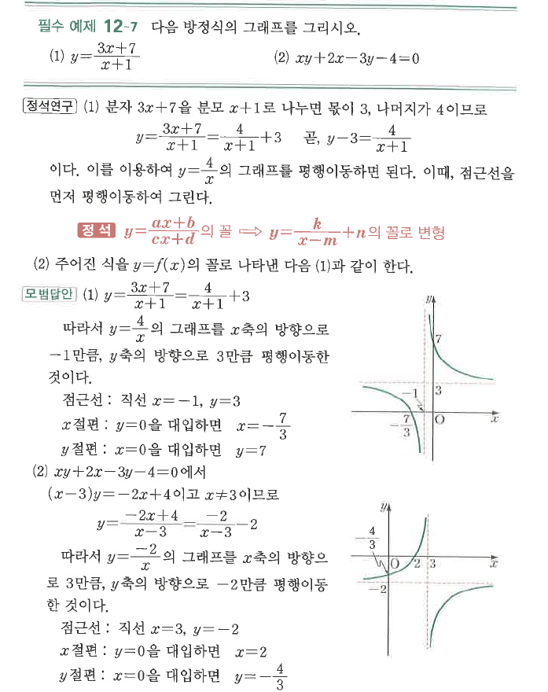
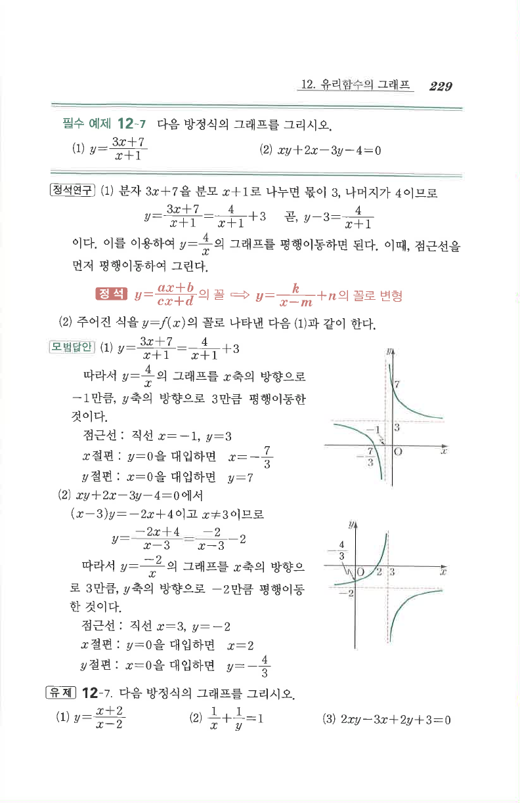

# 필수 예제 12-7

## 문제

다음 방정식의 그래프를 그리시오.

1. $y=\dfrac{3x+7}{x+1}$
2. $xy+2x-3y-4=0$

## 정답

1. $y=\dfrac4{x+1}+3$, 점근선 $x=-1$, $y=3$, $x$절편 $-\dfrac73$, $y$절편 $7$
2. $y=-\dfrac2{x-3}-2$, 점근선 $x=3$, $y=-2$, $x$절편 $2$, $y$절편 $-\dfrac43$

## 도형

두 그래프 모두 $y=\frac{k}{x}$ 꼴을 평행이동한 쌍곡선이다. 첫 번째는 중심 $(-1,3)$, 두 번째는 중심 $(3,-2)$를 기준으로 대칭이다.

## 원문

