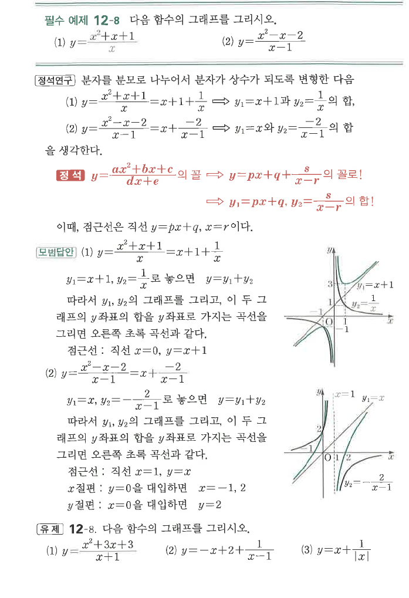
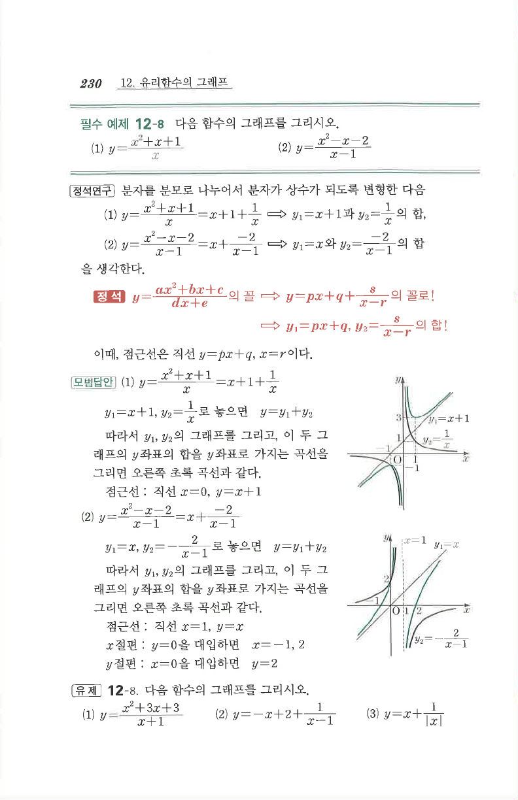

# 필수 예제 12-8

## 문제

다음 함수의 그래프를 그리시오.

1. $y=\dfrac{x^2+x+1}{x}$
2. $y=\dfrac{x^2-x-2}{x-1}$

## 정답

1. $y=x+1+\dfrac1x$, 점근선 $x=0$, $y=x+1$
2. $y=x-\dfrac2{x-1}$, 점근선 $x=1$, $y=x$, $x$절편 $-1,2$, $y$절편 $2$

## 도형

직선 점근선과 쌍곡선 성분의 $y$좌표 합으로 그래프를 그리는 유형이다. 첫 번째는 사선 점근선 $y=x+1$, 두 번째는 사선 점근선 $y=x$를 가진다.

## 원문

