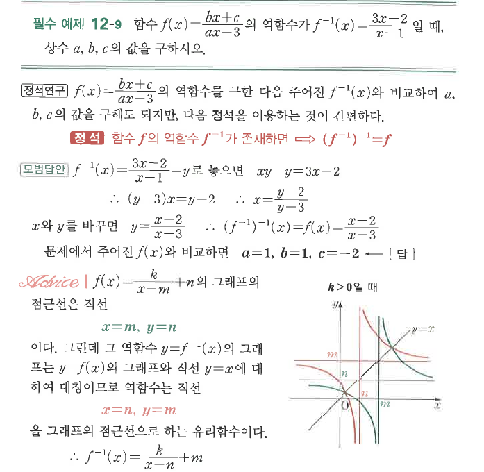

# 필수 예제 12-9

## 문제

함수
$$f(x)=\frac{bx+c}{ax-3}$$
의 역함수가
$$f^{-1}(x)=\frac{3x-2}{x-1}$$
일 때, 상수 $a$, $b$, $c$의 값을 구하시오.

## 정답

$a=1$, $b=1$, $c=-2$

## 도형

유리함수 $y=\frac{k}{x-m}+n$과 그 역함수의 그래프는 직선 $y=x$에 대하여 대칭이다. 점근선도 서로 $x=n$, $y=m$으로 바뀐다.

## 원문

