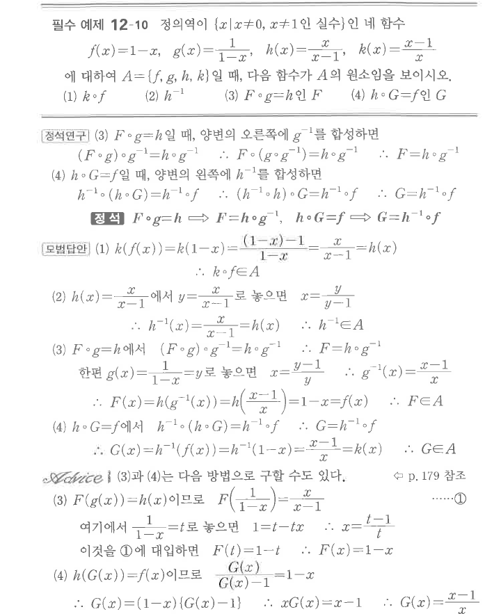
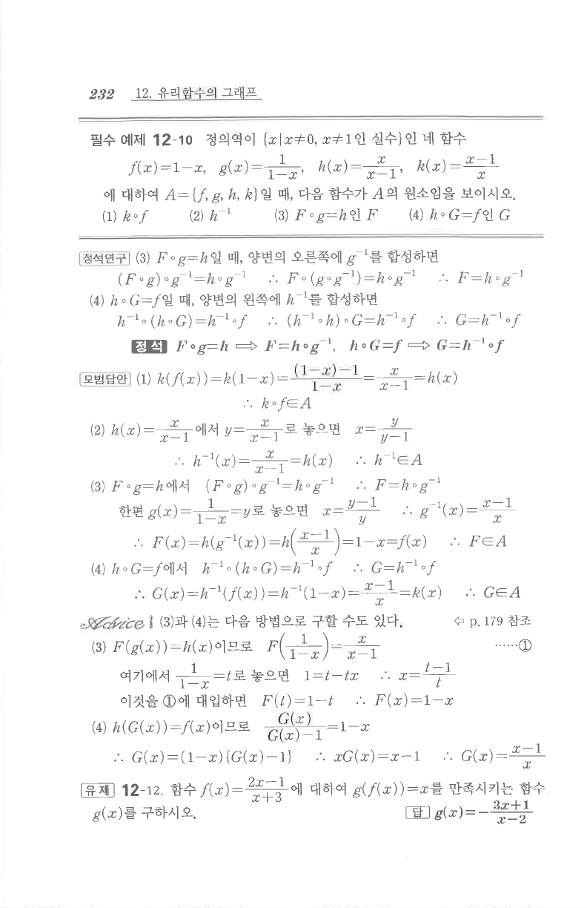

# 필수 예제 12-10

## 문제

정의역이 $\{x\mid x\ne0,\ x\ne1\}$인 네 함수
$$f(x)=1-x,\qquad g(x)=\frac1{1-x},\qquad h(x)=\frac{x}{x-1},\qquad k(x)=\frac{x-1}{x}$$
에 대하여 $A=\{f,g,h,k\}$일 때, 다음 함수가 $A$의 원소임을 보이시오.

1. $k\circ f$
2. $h^{-1}$
3. $F\circ g=h$인 $F$
4. $h\circ G=f$인 $G$

## 정답

1. $k\circ f=h$
2. $h^{-1}=h$
3. $F=f$
4. $G=k$

## 원문

